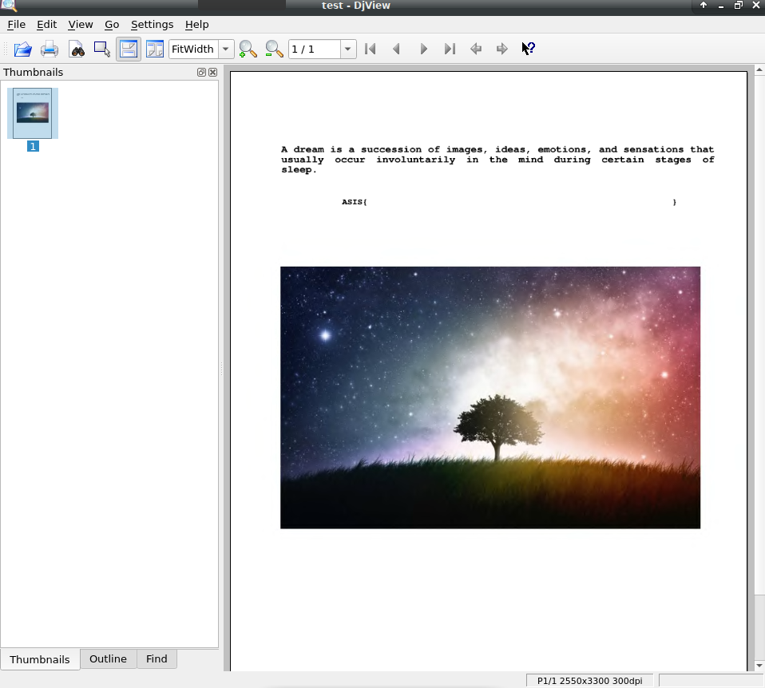

# ASIS CTF Finals 2020 – Dream

* **Category:** forensics
* **Points:** 77

## Challenge

> We are in a dream, within another dream!

## Solution

The challenge gives you [an archive](flag.malformed_71e395c65c735db4286467312481a7187f09f1da.txz).

Opening the archive and examining its content, will reveal the presence of some interesting strings.

```
root@m3ss4p0:~/Scrivania# tar xf flag.malformed_71e395c65c735db4286467312481a7187f09f1da.txz
root@m3ss4p0:~/Scrivania# strings flag.malformed
DIRM
NAVM
FORM
DJVIANTz
,'F9FN
wK)V
u[PVi
54U5
Q9->
BZ&0Yl
cQ.5
`q#r
ec->
\'_pO
FORM
DJVUINFO
INCL
shared_anno.iff
<REDACTED>
```

The format of the file is [*DjVu*](https://en.wikipedia.org/wiki/DjVu).

Some tools can be installed to manipulate this kind of files.

```
sudo apt-get install djview
sudo apt-get install djvulibre-bin
root@m3ss4p0:~/Scrivania# djvudump flag.malformed
  DIRM [52] 
  NAVM [28] 
  FORM:DJVI [920] 
    ANTz [908]        Page annotation (hyperlinks, etc.)
  FORM:DJVU [31774] 
    INFO [10]         DjVu 2550x3300, v24, 300 dpi, gamma=2.2
    INCL [15]         Indirection chunk --> {shared_anno.iff}
    Sjbz [935]        JB2 bilevel data
    FGbz [15]         JB2 colors data, v0, 1 colors
    BG44 [4488]       IW4 data #1, 72 slices, v1.2 (color), 850x1100
    BG44 [3574]       IW4 data #2, 11 slices
    BG44 [7090]       IW4 data #3, 10 slices
    BG44 [15155]      IW4 data #4, 10 slices
    TXTz [412]        Hidden text (text, etc.)
```

The file can't be opened because it's malformed. Removing the first part of the file with an hexeditor will give a [well-formed file](test).

```
root@m3ss4p0:~/Scrivania# djvudump test 
  FORM:DJVU [31774] 
    INFO [10]         DjVu 2550x3300, v24, 300 dpi, gamma=2.2
    INCL [15]         Indirection chunk --> {shared_anno.iff}
    Sjbz [935]        JB2 bilevel data
    FGbz [15]         JB2 colors data, v0, 1 colors
    BG44 [4488]       IW4 data #1, 72 slices, v1.2 (color), 850x1100
    BG44 [3574]       IW4 data #2, 11 slices
    BG44 [7090]       IW4 data #3, 10 slices
    BG44 [15155]      IW4 data #4, 10 slices
    TXTz [412]        Hidden text (text, etc.)
```

If you open the file with DjView, the flag seems to be empty.



But it is sufficient to copy and paste its content in order to find the flag.

```
ASIS{_DJVU_f1L3_f0rM4t_iZ_DejaVu}
```