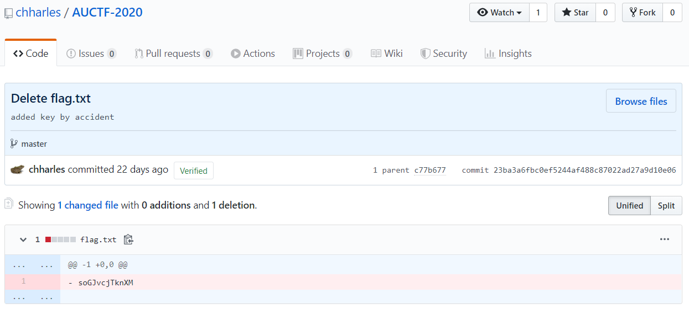
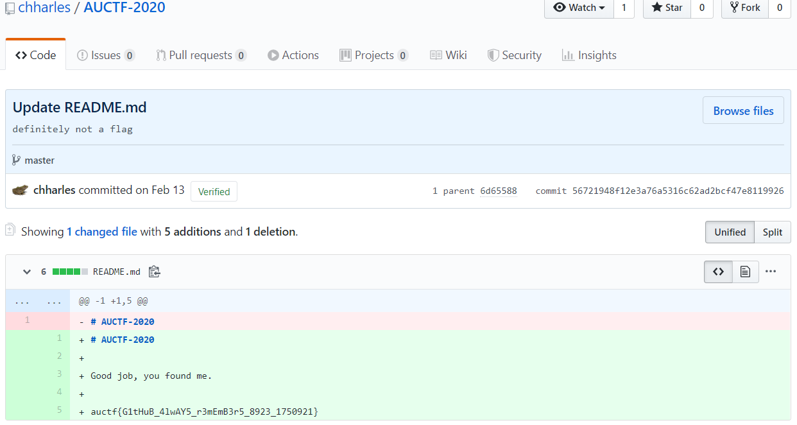

# AUCTF 2020 – Who Made Me

* **Category:** OSINT
* **Points:** 950

## Challenge

> One of the developers of this CTF worked really hard on this challenge.
> 
> note: the answer is not the author's name
> 
> Author: c

## Solution

The official Github profile of *Auburn University Ethical Hacking Club
* is `https://github.com/auehc`.

One of the members is `https://github.com/vincentchu37` and he has an interesting repository: `https://github.com/vincentchu37/AUCTF-2020`.

That repository was created by `https://github.com/chharles`, the author of the challenge.

Analyzing the commits, one regarding the flag can be found (`https://github.com/chharles/AUCTF-2020/commit/23ba3a6fbc0ef5244af488c87022ad27a9d10e06`), but the reported flag is a false one (`soGJvcjTknXM`).



Lookin further, the commit with the flag can be found (`https://github.com/chharles/AUCTF-2020/commit/56721948f12e3a76a5316c62ad2bcf47e8119926`).



The flag is the following.

```
auctf{G1tHuB_4lwAY5_r3mEmB3r5_8923_1750921}
```