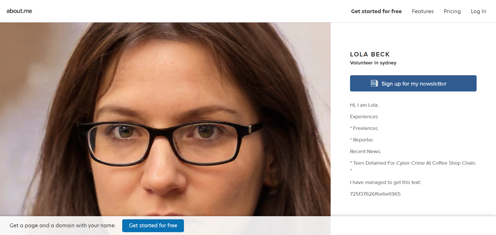
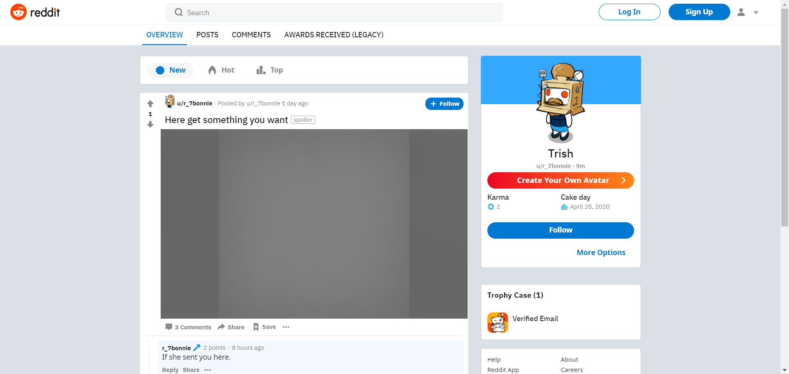
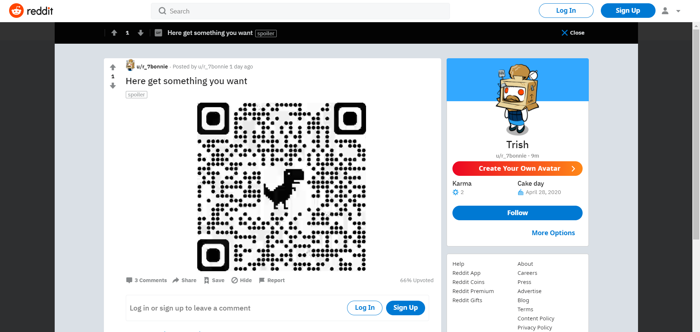
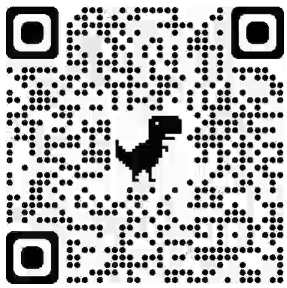

# DarkCON CTF 2021 – The Reporter

* **Category:** OSINT
* **Points:** ?

## Challenge

> Miss Lola beck has something on her social media account. You are Agent P. find the secret.
> 
> Hint : username l.beck

## Solution

The first step is to use `userfinder`.

```
root@m3ss4p0:~/Tools/userfinder# python ./userfinder.py l.beck

 _   _               _____ _           _
| | | |___  ___ _ __|  ___(_)_ __   __| | ___ _ __
| | | / __|/ _ \ '__| |_  | | '_ \ / _` |/ _ \ '__|
| |_| \__ \  __/ |  |  _| | | | | | (_| |  __/ |
 \___/|___/\___|_|  |_|   |_|_| |_|\__,_|\___|_|

by tr4cefl0w

[*] Searching...
[+] Profile found: https://www.instagram.com/l.beck/
[+] Profile found: https://www.facebook.com/LBeck
[+] Profile found: https://twitter.com/l.beck
[+] Profile found: https://about.me/l.beck
[+] Profile found: https://imgur.com/user/l.beck
[+] Profile found: https://open.spotify.com/user/l.beck
[+] Profile found: https://www.mixcloud.com/l.beck/
[+] Profile found: https://badoo.com/
[+] Profile found: https://trakt.tv/users/l.beck
```

`https://about.me/l.beck` contains the following text, so it could be the right track. The button in the page contains a link to `reddit.com`.

> Hi, I am Lola.
> 
> Experiences
> 
> * Freelancer,
> 
> * Reporter.
> 
> Recent News:
> 
> " Teen Detained For Cyber Crime At Coffee Shop Chain. "
> 
> I have managed to get this text:
> 
> 725f37626f6e6e6965



Decoding the text `725f37626f6e6e6965`, from hex to ASCII, you can find the following string: `r_7bonnie`.

```
root@m3ss4p0:~/Tools/userfinder# python ./userfinder.py r_7bonnie

 _   _               _____ _           _
| | | |___  ___ _ __|  ___(_)_ __   __| | ___ _ __
| | | / __|/ _ \ '__| |_  | | '_ \ / _` |/ _ \ '__|
| |_| \__ \  __/ |  |  _| | | | | | (_| |  __/ |
 \___/|___/\___|_|  |_|   |_|_| |_|\__,_|\___|_|

by tr4cefl0w

[*] Searching...
[+] Profile found: https://www.facebook.com/arie.hasit
[+] Profile found: https://twitter.com/r_7bonnie
[+] Profile found: https://www.reddit.com/user/r_7bonnie
[+] Profile found: https://imgur.com/user/r_7bonnie
[+] Profile found: https://open.spotify.com/user/r_7bonnie
[+] Profile found: https://www.mixcloud.com/r_7bonnie/
[+] Profile found: https://badoo.com/
[+] Profile found: https://500px.com/p/r_7bonnie
```

Considering that there was a link to Reddit, you can try it for first.

```
https://www.reddit.com/user/r_7bonnie
```



The name, *Trish*, is the same of the challenge creator.

There is a post with a GIF which contains a *MaxiCode* image.

```
https://www.reddit.com/user/r_7bonnie/comments/lmrxae/here_get_something_you_want/
```



Decoding with an [on-line tool](https://zxing.org/w/decode.jspx) you can find the flag.



```
darkCON{os1nst_1s_nic3}
```