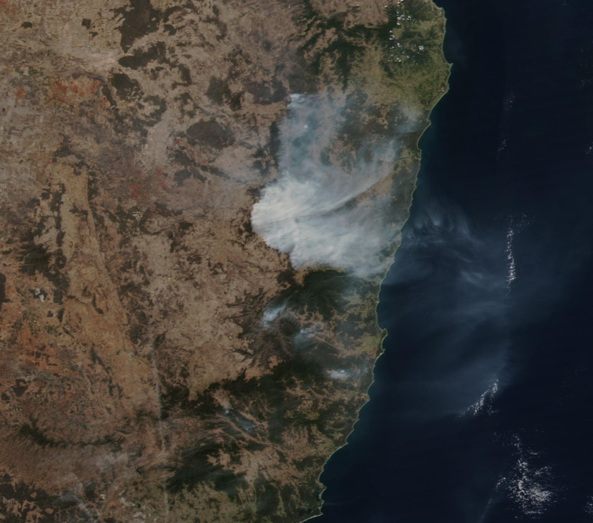

# DarkCTF 2020 – Time Travel

* **Category:** OSINT
* **Points:** 450

## Challenge

> Can you find the exact date this pic was taken (It is Australian forest fire)
> 
> Flag Format: darkCTF{dd-mm-yyyy}

## Solution

The challenge gives you an image regarding to Australian forest fires.



On the [NASA satellite website](https://worldview.earthdata.nasa.gov/) you can find a section regarding the Australian forest fires.

```
https://worldview.earthdata.nasa.gov/?v=87.85473293897292,-48.20074873233189,175.61111373497772,-6.436481569649914&t=2019-09-07-T15%3A25%3A24Z&l=VIIRS_SNPP_Thermal_Anomalies_375m_Day(hidden),VIIRS_SNPP_Thermal_Anomalies_375m_Night(hidden),Reference_Labels(hidden),Reference_Features(hidden),Coastlines,VIIRS_SNPP_CorrectedReflectance_TrueColor,MODIS_Aqua_CorrectedReflectance_TrueColor(hidden),MODIS_Terra_CorrectedReflectance_TrueColor(hidden)&tr=australia_fires_2019_2020
```

Playing around with the days you can find the 15 September which is identical to the provided image.


So the flag is the following.

```
darkCTF{15-09-2019}
```