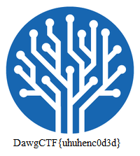

# DawgCTF 2020 – Me Me

* **Category:** misc
* **Points:** 100

## Challenge

> You, you want to solve this?
> 
> Author: Novetta

## Solution

This challenge gives you [a file](enc).

This file seems to contains data encoded with [*uuencoding* format](https://en.wikipedia.org/wiki/Uuencoding), but first and last lines are strange.

```
egin 664 uhuh
...
nd
```

It seems that the first char of each line has been removed. The first and the last lines are easy to recover. For data lines you have to consider the format of the lines.

```
<length character><formatted characters><newline>

All data lines except the last (if the data length was not divisible by 45), have 45 bytes of encoded data (60 characters after encoding). Therefore, the vast majority of length values is 'M', (32 + 45 = ASCII code 77 or 'M').
```

So the first char of every line except the last one is `M`.

The first char of the last line is `E`, because that line has 8 chars less than 60 chars lines (i.e. 52 chars), so the correct letter to use is 8 letters before `M`: the `E`.

You have now the [correct original file](enc.corrected) and you decode it ([online](http://uuencode.online-domain-tools.com/)).

It will give you a PNG image with the flag.



The flag is the following.

```
DawgCTF{uhuhenc0d3d}
```