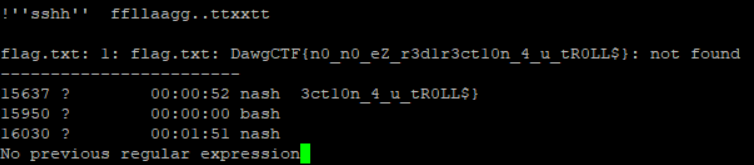

# DawgCTF 2020 – Nash2

* **Category:** pwn
* **Points:** 200

## Challenge

> It's nospacebash for real this time!
> 
> nc ctf.umbccd.io 5800
> 
> Author: BlueStar

## Solution

You have to print the `flag.txt` file but your shell can't use spaces and you can't redirect with `<` (that was the unintended solution of the original challenge *Nash*).

There is a well-known bash jail escape tecnique which uses the command `more`, that is available on the system. To use it, you have to find something long enough to be passed into `more`.

Luckily that host had a lot of processes, so to launch `more` the command was the following.

`nash> ps|more`

At this point, you can use the jail escape tecnique.

`!'sh' flag.txt`

The `sh` interpreter will try to execute the `flag.txt` file, spawning an error which will reveal its content.



The flag is the following.

```
DawgCTF{n0_n0_eZ_r3d1r3ct10n_4_u_tR0LL$}
```