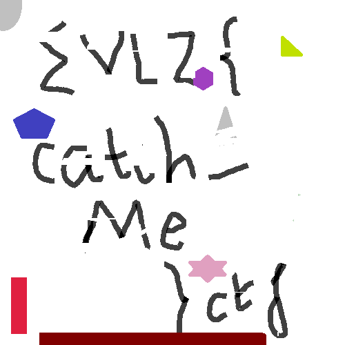

# Evlz CTF 2019 – Don't Blink

* **Category:** Misc
* **Points:** 100

## Challenge

> Do you have persistence of vision? Well try it out with this file

## Solution

The file is a GIF image which shows several frames containg parts of the final flag.


The GIF must be split (e.g. using [https://ezgif.com/split](https://ezgif.com/split)) and then each frame must be merged in the same final image, ignoring white background.

The merge operation can be performed via script or using an image manipulation program (*MS Paint* can be fine).

The final image will be:



Hence, the flag is:

```
evlz{catch_me}ctf
```