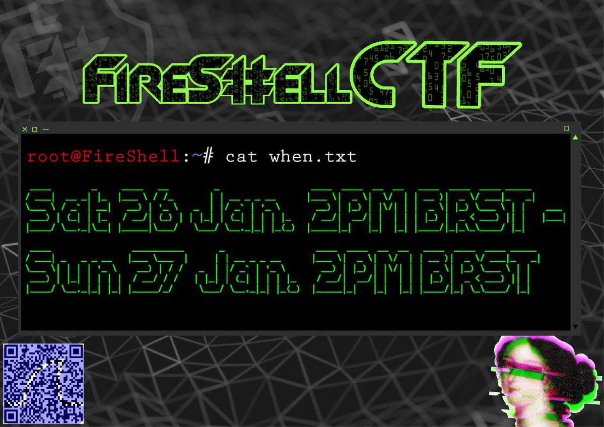
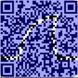

# FireShell CTF – Social

* **Category:** recon
* **Points:** 60

## Solution

In the Twitter profile of FireShell there is a tweet regarding the CTF.

[https://twitter.com/fireshellst/status/1076088994574860288](https://twitter.com/fireshellst/status/1076088994574860288)

The tweet contains an image.



In the image there is a QR code.



Decoding the QR code via [https://webqr.com/](https://webqr.com/) will reveal the following content with the flag.

```
https://fireshellsecurity.team/ https://www.facebook.com/fireshellst/ https://twitter.com/fireshellst F#{4re_Y0u_r3c0n?!!_:)}
```