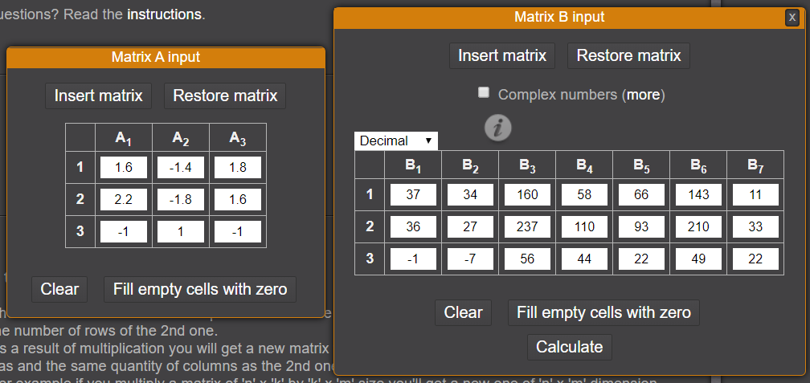
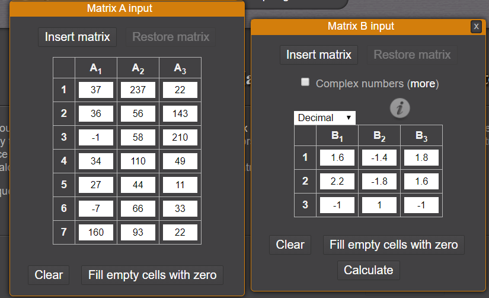

# Houseplant CTF 2020 – Post-Homework Death

* **Category:** crypto
* **Points:** 570

## Challenge

> My math teacher made me do this, so now I'm forcing you to do this too.
> 
> Flag is all lowercase; replace spaces with underscores.
> 
> Dev: Claire
> 
> Hint! When placing the string in the matrix, go up to down rather than left to right.
> 
> Hint! Google matrix multiplication properties if you're stuck.
>
> posthomeworkdeaths.txt 1459c156daa68f0d7bfcc698a18e93e8

## Solution

The challenge gives you a [text file](posthomeworkdeaths.txt).

```
Decoding matrix:

1.6  -1.4  1.8
2.2  -1.8  1.6
-1     1    -1


String:

37 36 -1 34 27 -7 160 237 56 58 110 44 66 93 22 143 210 49 11 33 22
```

Based on the hints, you have to perform a matrix multiplication. An [on-line tool](https://matrix.reshish.com/multiplication.php) can be used.

The commutative property of multiplication **does not hold!** So you can have two different results:
* one with decoding matrix used as the first operand;
* another with decoding matrix used as the second operand.

The columns of the first operand must be the same of the rows of the second operand, so you have to craft the string matrix accordingly.





The correct operation is the first one.

```
 7   4  25  18  15  23  11
15  15  15   0  13  15   0
 0   0  21   8   5  18   0
```

Data can be read with the same order of the string matrix: *up to down rather than left to right*.

```
7 15 0 4 15 0 25 15 21 18 0 8 15 13 5 23 15 18 11 0 0
```

Data is encrypted with A1Z26 cipher (`0` is space), so the original value is the following.

```
go do your homework
```

The flag is the following.

```
rtcp{go_do_your_homework}
```