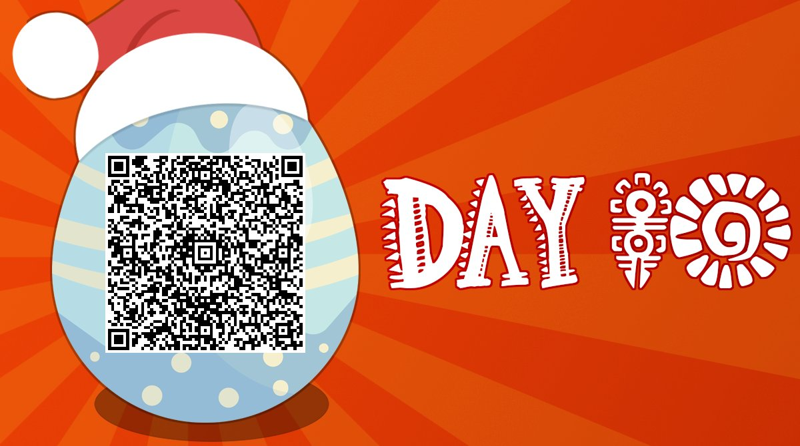
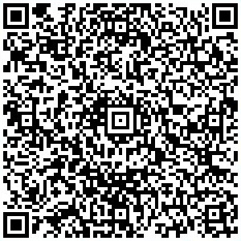
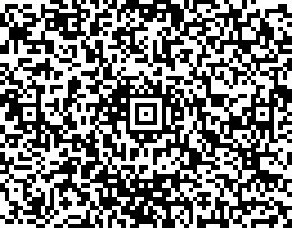

# OverTheWire Advent Bonanza 2019 – Easter Egg 3

* **Category:** fun
* **Points:** 10

## Challenge

> Easter Egg 2
>
> Service: https://twitter.com/OverTheWireCTF
> 
> Author: EasterBunny

## Solution

An image was posted on Twitter.



The image contains two nested barcodes.

The *QR code* can be analyzed simply cutting the code portion and analyzing it.



Decoding it will give the following.

```
137:64:137:154:171:146:63:175
```

Decoding from octal representation to ASCII will give the following.

```
_4_lyf3}
```

Then you have to cut the *Aztec code* from the global one.



Decoding it will give the following.

```
414f54577b6234726330643373
```

Decoding from hexadecimal representation to ASCII will give the following.

```
AOTW{b4rc0d3s
```

Putting everything together will give you the flag.

```
AOTW{b4rc0d3s_4_lyf3}
```