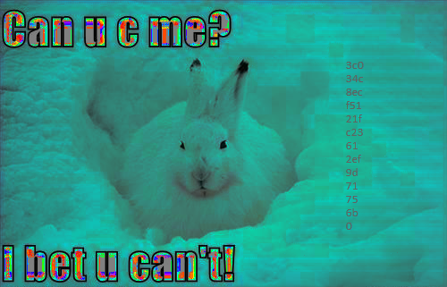

# Quals Saudi and Oman National Cyber Security CTF 2019 – Try to see me

* **Category:** Digital Forensics
* **Points:** 100

## Challenge

> you'll need your glasses or good pair of eyes and some brainzzz.
>
> [https://s3-eu-west-1.amazonaws.com/hubchallenges/Forensics/final](https://s3-eu-west-1.amazonaws.com/hubchallenges/Forensics/final)

## Solution

This is a steganography challenge.

Analyzing the [file](final) with an hexadecimal editor, it will seem like a BMP file without the `BM` file signature. It is sufficient to modify the first two bytes with `BM` signature and to rename it with `.bmp` extension to open the image.


The image contains a message: *"Can u c me? I bet u can't!"*, and on the right something is written with a very light color.



```
3c0
34c
8ec
f51
21f
c23
61
2ef
9d
71
75
6b
0
```

That is: `3c034c8ecf5121fc23612ef9d71756b0`. This is not the flag, but the MD5 hash of: `potatoman`.

Trying with *steghide*, you will discover that something is hidden in the image, without filename and protected with the previous hash.

```
$ steghide --info final.bmp -p 3c034c8ecf5121fc23612ef9d71756b0
"final.bmp":
  format: Windows 3.x bitmap
  capacity: 19.6 KB
  embedded data:
    size: 32.0 Byte
    encrypted: rijndael-128, cbc
    compressed: yes
```

You can use *steghide* to extract it.

```
$ steghide --extract -sf final.bmp -p 3c034c8ecf5121fc23612ef9d71756b0 -xf final.out
wrote extracted data to "final.out".
```

The extracted file is a text file with the flag.

```
d78e573bcae3899be1751e414c17b84c
```