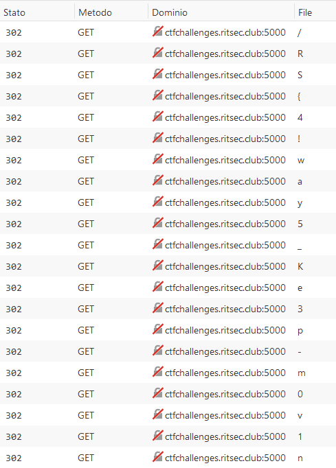

# RITSEC CTF 2019 – misdirection

* **Category:** web
* **Points:** 100

## Challenge

> Looks like someone gave you the wrong directions!
>
> http://ctfchallenges.ritsec.club:5000/
>
> Flag format is RS{ }
>
> Author: f1rehaz4rd

## Solution

Connecting to the website, you will experience multiple redirections from one page to another.



Each page has one letter for the name. Analyzing the requested pages and tuning the starting point of the redirection, you can discover the full flag one char at a time.

The flag is the following.
```
RS{4!way5_Ke3p-m0v1ng}
```