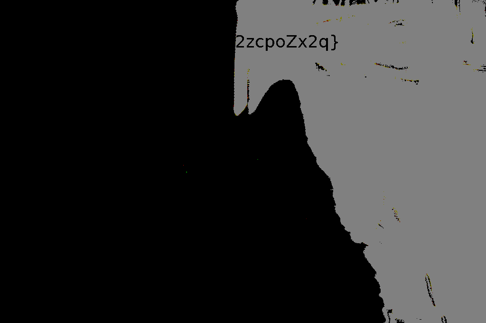

# STEM CTF Cyber Challenge 2019 – Nomination

* **Category:** Grab Bag
* **Points:** 100

## Challenge

> Surprised Pikachu is old. Let’s get this surprised cat going.

## Solution

The challenge gives you an image.


The flag is hidden in that image and splittend in two parts. You can read it using an image manipulation software.

Brightness and contrast to the maximum will reveal the left part.


Brightness to the minimum and contrast to the maximum will reveal the right part.



The flag is the following.

```
MCA{g1jVx4a2zcpoZx2q}
```