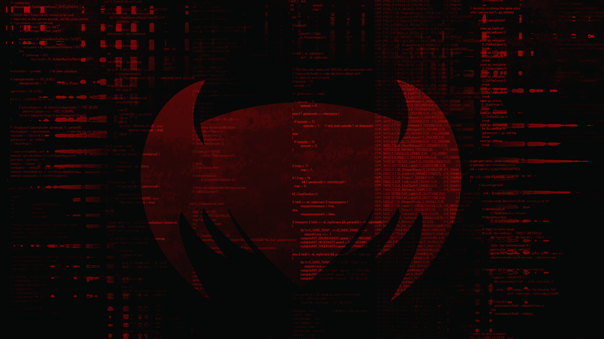

# Securinets Prequals CTF 2019 – EZ

* **Category:** Misc
* **Points:** 331

## Challenge

> Welcome to Securinets, this one is an easy one.
>
> Please make sure you hash the WORD with sha1 (lowercase hash letter)
>
> The final flag is : Securinets{the_hash_of_the_word}
>
> [pic.png](pic.png)
>
> Author:BlueWhale

## Solution

The challenge gives the following PNG file to analyze.



One of the basic techniques of steganography is to hide information into MSB or LSB of an image.

[SHIT - Stego Helper Identification Tool](https://github.com/qll/shit) is a tool which allows to retrieve that information.

Launching the tool with the following command

```
python retrieve.py bit 7 pic.png 
```

will retrieve the following text.

```
--START--
"The fact is that upon his entrance I had instantly recognized the extreme
personal danger in which I lay. The only conceivable escape for him lay in silencing
my tongue. In an instant I had slipped the revolver from the drawer into my
pocket and was covering him through the cloth. At his remark I drew the weapon
out and laid it cocked upon the table. He still smiled and blinked, but there was
something about his eyes which made me feel very glad that I had it there,
"You evidently don't know me,' said he.
"'On the contrary,' I answered, 'I think it is fairly evident that I do. Pray take
a chair. I can spare you five minutes if you have anything to say.'
"'All that I have to say has already crossed your mind,' said he.
"'Then possibly my answer has crossed yours,' I replied.
"'You stand fast?'
"'Absolutely.'
"He clapped his hand into his pocket, and I raised the pistol from the table.
But he merely drew out a <DETELED_WORD> in which he had scribbled some
dates.
"You crossed my path on the fourth of January,' said he. 'On the twenty-third
you incommoded me; by the middle of February I was seriously inconvenienced
by you; at the end of March I was absolutely hampered in my plans; and now, at
the close of April, I find myself placed in such a position through your continual
persecution that I am in positive danger of losing my liberty. The situation is
becoming an impossible one.'
"'Have you any suggestion to make?' I asked.
"'You must drop it, Mr. Holmes,' said he, swaying his face about. 'You really
must, you know.'"
--END--;
```

In that text there is a `<DETELED_WORD>`. Googling the text, you can discover that the deleted word is: `memorandum-book`.

The SHA-1 hash of that word is: `b47f0d2a8866a75696f94a515d0cdf54c7ea3174`.

Hence the flag is the following.

```
Securinets{b47f0d2a8866a75696f94a515d0cdf54c7ea3174}
```